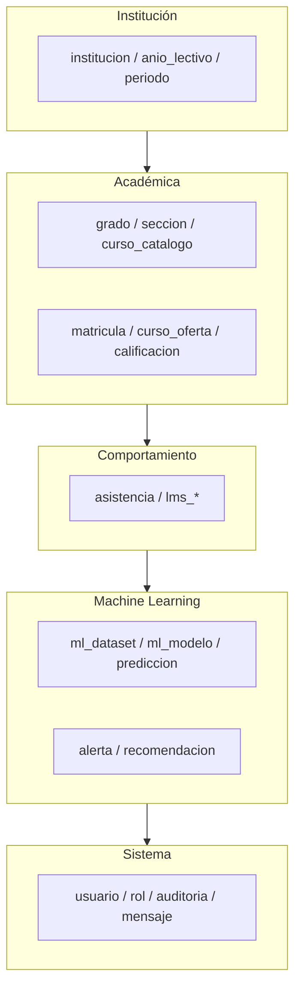

# Base de datos — I.E.P. Blenkir (Primaria)

> Rediseño v3 · Sistema de predicción de riesgo de deserción estudiantil con Machine Learning

## Contexto institucional

| Atributo | Valor |
|----------|-------|
| Institución | I.E.P. Blenkir — Huancayo, Perú |
| Nivel | **Primaria** (1° a 6°) |
| Secciones | A, B, C, D (5° y 6° solo A, B, C) |
| Total secciones | **22** |
| Alumnos por sección | ~30 |
| Total estudiantes | **660** |
| Cursos en catálogo | **16** |
| Personal docente | **15** profesores + **1** director |

### Distribución de secciones

| Grado | Secciones | Cantidad |
|-------|-----------|----------|
| 1° | A, B, C, D | 4 |
| 2° | A, B, C, D | 4 |
| 3° | A, B, C, D | 4 |
| 4° | A, B, C, D | 4 |
| 5° | A, B, C | 3 |
| 6° | A, B, C | 3 |
| **Total** | | **22** |

### Catálogo de cursos (16)

| Área | Cursos |
|------|--------|
| Matemática | Aritmética, Álgebra, Razonamiento Matemático, Geometría |
| Comunicación | Producción de Textos, Gramática, Razonamiento Verbal |
| Ciencia | Cuerpo Humano, Mundo Físico |
| Ciencias Sociales | Ciudadanía, Geografía, Historia |
| Transversal | Religión, Inglés, Taller, Educación Física |

---

## Resumen del diseño

- **Motor:** MySQL 8.0+ (InnoDB, utf8mb4)
- **Tablas:** **51** (rango solicitado 45–55)
- **Normalización:** 3FN en módulos transaccionales; desnormalización controlada solo en snapshots ML y KPIs
- **Convención:** `snake_case`, PK `BIGINT UNSIGNED AUTO_INCREMENT`, FK con `ON DELETE` explícito
- **Scripts:** `01-schema.sql` → `02-seed-estructura.sql` → `03-seed-poblacion.sql`

---

## Listado completo de tablas (51)

### Módulo 1 — Institución y calendario (3)

| # | Tabla | Justificación |
|---|-------|---------------|
| 1 | `institucion` | Datos legales y de contacto del colegio Blenkir; ancla todo el modelo |
| 2 | `anio_lectivo` | Año escolar activo (2026); base para matrículas y periodos |
| 3 | `periodo_academico` | Bimestres/trimestres; agrega notas y asistencia por ventana temporal |

### Módulo 2 — Estructura académica (6)

| # | Tabla | Justificación |
|---|-------|---------------|
| 4 | `nivel_educativo` | Primaria (extensible); separa reglas curriculares |
| 5 | `grado` | 1°–6° primaria; define cohorte etaria |
| 6 | `seccion` | 22 aulas (A–D); unidad operativa de matrícula |
| 7 | `area_curricular` | Agrupa los 16 cursos por dominio MINEDU |
| 8 | `curso_catalogo` | Catálogo maestro de asignaturas Blenkir |
| 9 | `curso_grado` | Qué cursos aplican a cada grado (p. ej. Álgebra desde 3°) |

### Módulo 3 — Seguridad y RBAC (6)

| # | Tabla | Justificación |
|---|-------|---------------|
| 10 | `rol` | Director, Profesor, Estudiante (`admin`, `docente`, `estudiante`) |
| 11 | `permiso` | Permisos granulares por módulo |
| 12 | `rol_permiso` | Matriz RBAC N:M |
| 13 | `usuario` | Credenciales, perfil, estado; enlace a profesor/estudiante |
| 14 | `sesion` | JWT/refresh persistido; revocación y trazabilidad |
| 15 | `intento_login` | Protección brute-force; auditoría de accesos fallidos |

### Módulo 4 — Personas (4)

| # | Tabla | Justificación |
|---|-------|---------------|
| 16 | `profesor` | 15 docentes; especialidad y contacto |
| 17 | `estudiante` | 660 alumnos; estado académico y métricas agregadas para ML |
| 18 | `apoderado` | Contacto familiar; factor contextual de deserción |
| 19 | `estudiante_apoderado` | Vínculo N:M con parentesco y apoderado principal |

### Módulo 5 — Oferta y matrícula (5)

| # | Tabla | Justificación |
|---|-------|---------------|
| 20 | `tutor_seccion` | Docente titular por sección/año (tutoría) |
| 21 | `curso_oferta` | Instancia curso + sección + profesor + periodo (clase real) |
| 22 | `matricula` | Estudiante inscrito en sección por año lectivo |
| 23 | `inscripcion_curso` | Matrícula en cada `curso_oferta`; base para notas/LMS |
| 24 | `horario_clase` | Horario semanal; coherencia operativa del colegio |

### Módulo 6 — Rendimiento académico (2)

| # | Tabla | Justificación |
|---|-------|---------------|
| 25 | `calificacion` | Notas por bimestre y curso; feature `promedio_general` |
| 26 | `historial_academico` | Resumen por periodo; serie temporal para ML |

### Módulo 7 — Asistencia (2)

| # | Tabla | Justificación |
|---|-------|---------------|
| 27 | `asistencia` | Registro diario (presente/tardanza/justificado) |
| 28 | `resumen_asistencia` | % mensual/bimestral; feature `asistencia_general` |

### Módulo 8 — LMS (3)

| # | Tabla | Justificación |
|---|-------|---------------|
| 29 | `lms_actividad_semanal` | Accesos, minutos, actividad % por semana |
| 30 | `lms_entrega_tarea` | Ratio tareas; feature `tareas_ratio` |
| 31 | `lms_indicador_estudiante` | Snapshot agregado LMS por periodo (foros, caída actividad) |

### Módulo 9 — Machine Learning (5)

| # | Tabla | Justificación |
|---|-------|---------------|
| 32 | `ml_dataset` | Versiones de datasets de entrenamiento (CSV/ruta, hash) |
| 33 | `ml_entrenamiento` | Ejecución de `train.py`; hiperparámetros y duración |
| 34 | `ml_modelo` | Artefactos `.joblib`; modelo activo en producción |
| 35 | `ml_metrica` | Accuracy, Precision, Recall, F1, matriz confusión JSON |
| 36 | `ml_feature_def` | Catálogo de las 10 variables de la tesis; trazabilidad |

### Módulo 10 — Predicción e IA (4)

| # | Tabla | Justificación |
|---|-------|---------------|
| 37 | `prediccion` | Resultado por estudiante: score, nivel, probabilidad |
| 38 | `prediccion_feature_snapshot` | Vector de entrada usado en inferencia (reproducibilidad) |
| 39 | `prediccion_factor` | Factores explicables (SHAP/heurística) |
| 40 | `recomendacion` | Acciones sugeridas vinculadas a predicción/factor |

### Módulo 11 — Alertas tempranas (3)

| # | Tabla | Justificación |
|---|-------|---------------|
| 41 | `alerta` | Alerta activa por riesgo medio/alto |
| 42 | `alerta_historial` | Cambios de estado (`nueva` → `en_seguimiento` → `resuelta`) |
| 43 | `alerta_factor` | Factores que dispararon la alerta |

### Módulo 12 — Mensajería académica (3)

| # | Tabla | Justificación |
|---|-------|---------------|
| 44 | `mensaje_sala` | Salas: global, profesores, curso, directo |
| 45 | `mensaje` | Comunicados y mensajes profesor–estudiante |
| 46 | `mensaje_lectura` | Estado leído por usuario |

### Módulo 13 — Auditoría, reportes y sistema (4)

| # | Tabla | Justificación |
|---|-------|---------------|
| 47 | `auditoria` | Log inmutable de acciones CRUD sensibles |
| 48 | `reporte` | Metadatos de reportes exportados (PDF/Excel) |
| 49 | `notificacion` | Push in-app por alertas, predicciones, sistema |
| 50 | `dashboard_snapshot` | KPIs históricos para analytics institucional |
| 51 | `configuracion_sistema` | Parámetros globales (umbrales ML, año activo) |

---

## Relaciones principales

```
institucion ──< anio_lectivo ──< periodo_academico
nivel_educativo ──< grado ──< seccion ──< matricula >── estudiante
curso_catalogo ──< curso_grado >── grado
curso_catalogo ──< curso_oferta >── seccion, profesor, periodo
estudiante ──< inscripcion_curso >── curso_oferta
estudiante ──< calificacion, asistencia, lms_*, prediccion, alerta
ml_entrenamiento ──< ml_modelo ──< ml_metrica
prediccion ──< prediccion_factor, prediccion_feature_snapshot, recomendacion
alerta ──< alerta_historial, alerta_factor
mensaje_sala ──< mensaje ──< mensaje_lectura
usuario ──< sesion, notificacion, auditoria
```

---

## Índices estratégicos (ML y operación)

| Tabla | Índice | Propósito |
|-------|--------|-----------|
| `estudiante` | `(estado, activo)` | Filtro cohortes en riesgo |
| `estudiante` | `(seccion_id)` | Dashboard por aula |
| `matricula` | `(anio_lectivo_id, seccion_id)` | Listados por sección |
| `calificacion` | `(estudiante_id, periodo_id)` | Cálculo promedios |
| `asistencia` | `(estudiante_id, fecha)` UNIQUE | Evitar duplicados |
| `lms_indicador_estudiante` | `(estudiante_id, periodo_id)` | Features LMS |
| `prediccion` | `(estudiante_id, created_at DESC)` | Historial ML |
| `prediccion` | `(nivel_riesgo)` | KPIs dashboard |
| `alerta` | `(estado, nivel_riesgo)` | Bandeja alertas |
| `auditoria` | `(entidad, created_at)` | Consultas forenses |

---

## Variables ML (10 features — tesis)

Definidas en `ml_feature_def` y materializadas en `prediccion_feature_snapshot`:

1. `promedio_general` ← `historial_academico` / `calificacion`
2. `cursos_desaprobados` ← agregado de `calificacion`
3. `asistencia_general` ← `resumen_asistencia`
4. `frecuencia_acceso_lms` ← `lms_actividad_semanal`
5. `tiempo_plataforma` ← `lms_actividad_semanal`
6. `tareas_ratio` ← `lms_entrega_tarea`
7. `participacion_actividades` ← `lms_indicador_estudiante`
8. `uso_foros` ← `lms_indicador_estudiante`
9. `disminucion_actividad` ← `lms_indicador_estudiante`
10. `estado` ← `estudiante.estado` (activo / en_riesgo / retirado)

---

## Diagrama entidad-relación

Ver diagrama completo en la sección siguiente (Mermaid). Para renderizar: GitHub, VS Code con extensión Mermaid, o [mermaid.live](https://mermaid.live).

```mermaid
erDiagram
    institucion ||--o{ anio_lectivo : tiene
    anio_lectivo ||--o{ periodo_academico : contiene
    nivel_educativo ||--o{ grado : incluye
    grado ||--o{ seccion : divide
    grado ||--o{ curso_grado : curriculum
    area_curricular ||--o{ curso_catalogo : agrupa
    curso_catalogo ||--o{ curso_grado : asigna
    curso_catalogo ||--o{ curso_oferta : instancia
    seccion ||--o{ curso_oferta : oferta
    seccion ||--o{ matricula : matricula
    seccion ||--o{ tutor_seccion : tutor
    profesor ||--o{ curso_oferta : dicta
    profesor ||--o{ tutor_seccion : titular
    estudiante ||--o{ matricula : inscrito
    estudiante ||--o{ inscripcion_curso : cursa
    curso_oferta ||--o{ inscripcion_curso : alumnos
    estudiante ||--o{ calificacion : obtiene
    estudiante ||--o{ asistencia : registra
    estudiante ||--o{ lms_actividad_semanal : genera
    estudiante ||--o{ lms_indicador_estudiante : metricas
    estudiante ||--o{ prediccion : predice
    ml_modelo ||--o{ prediccion : usa
    prediccion ||--o{ prediccion_factor : explica
    prediccion ||--o{ prediccion_feature_snapshot : entrada
    prediccion ||--o{ recomendacion : sugiere
    estudiante ||--o{ alerta : alerta
    alerta ||--o{ alerta_historial : seguimiento
    alerta ||--o{ alerta_factor : causa
    mensaje_sala ||--o{ mensaje : contiene
    mensaje ||--o{ mensaje_lectura : leido
    usuario ||--o{ sesion : autentica
    rol ||--o{ rol_permiso : tiene
    permiso ||--o{ rol_permiso : otorga
    usuario ||--o| profesor : perfil
    usuario ||--o| estudiante : perfil
    estudiante ||--o{ estudiante_apoderado : tiene
    apoderado ||--o{ estudiante_apoderado : representa
    ml_dataset ||--o{ ml_entrenamiento : entrena
    ml_entrenamiento ||--o{ ml_modelo : produce
    ml_modelo ||--o{ ml_metrica : evalua
    usuario ||--o{ auditoria : ejecuta
    usuario ||--o{ notificacion : recibe
```



### Vista por capas



---

## Ejecución de scripts

```bash
# MySQL / XAMPP
mysql -u root -p < database/blenkir-v3/01-schema.sql
mysql -u root -p tesis_blenkir < database/blenkir-v3/02-seed-estructura.sql
node database/blenkir-v3/generate-poblacion.mjs > database/blenkir-v3/03-seed-poblacion.sql
mysql -u root -p tesis_blenkir < database/blenkir-v3/03-seed-poblacion.sql
```

---

## Migración desde Prisma actual

El esquema Prisma (`backend/prisma/schema.prisma`) puede evolucionar hacia este diseño por fases:

1. Ajustar `seed.ts` a 22 secciones y 16 cursos Blenkir
2. Añadir tablas ML (`ml_modelo`, `ml_metrica`, snapshots)
3. Separar `ChatMessage` → `mensaje_sala` + `mensaje`
4. Ejecutar ETL desde tablas actuales si hay datos en producción

---

## Credenciales semilla

| Rol | Email | Password |
|-----|-------|----------|
| Director | director@blenkir.edu.pe | mbappe29 |
| Profesor 1–15 | profesor{N}@blenkir.edu.pe | mbappe29 |
| Estudiantes | estudiante{NNNN}@blenkir.edu.pe | mbappe29 |
