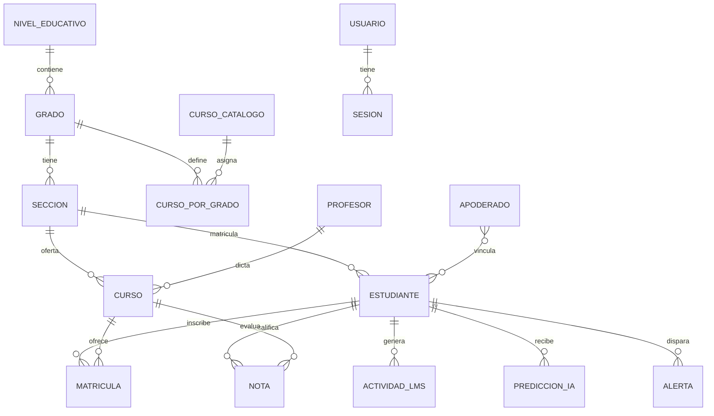

# Diagrama Entidad-Relación (DER)

## Modelo conceptual

**Modelo educativo peruano:** Primaria (1°–6°) y Secundaria (1°–5°), secciones A/B/C por grado.

**DBML (dbdiagram.io):** `database/dbml/schema.dbml`

## Entidades fuertes

- `ESTUDIANTE`, `PROFESOR`, `CURSO`, `USUARIO`

## Entidades débiles / dependientes

- `MATRICULA`, `HISTORIAL_ACADEMICO`, `ACTIVIDAD_LMS`, `PREDICCION_IA`, `ALERTA`

## Relaciones N:M

- Estudiante ↔ Curso vía **Matrícula** (con atributos: promedio, asistencia, periodo)

## Mejoras ≥40% vs. versión anterior

| Antes | Ahora |
|-------|-------|
| Sin BD (solo seed en memoria) | 18+ tablas normalizadas |
| Sin auditoría | Bitácora + triggers |
| Sin historial | Historial académico y riesgo por periodo |
| Sin roles | RBAC con 6 roles (incl. apoderado) |
| Sin niveles/grado/sección | Estructura Primaria/Secundaria Huancayo |
| Predicción efímera | Tabla `predicciones_ia` con trazabilidad |
| Sin alertas persistentes | Alertas con estados y workflow |

El esquema PostgreSQL completo está en `database/postgresql/schema.sql`.
