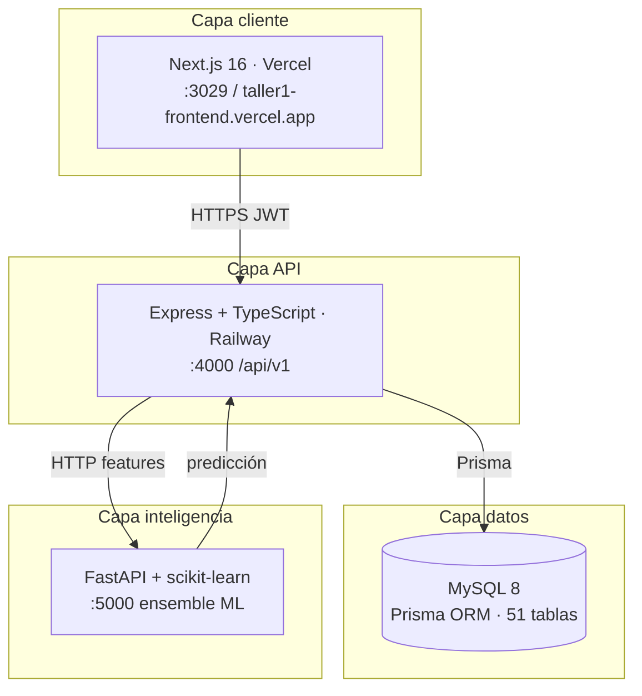

# Arquitectura general del sistema

**Proyecto:** Tesis Dashboard v2.0  
**Institución:** I.E.P. Blenkir Huancayo · Perú

---

## 1. Descripción

Sistema web **SaaS educativo** con tres capas desacopladas que integran gestión académica, dashboards multirol e **inteligencia artificial explicable** para predecir el riesgo de deserción estudiantil.

---

## 2. Diagrama de arquitectura



---

## 3. Componentes del monorepo

| Carpeta | Tecnología | Rol |
|---------|------------|-----|
| `frontend/` | Next.js 16, React 19 | UI, dashboards, formularios |
| `backend/` | Express, Prisma | API REST, auth, RBAC, orquestación |
| `machine-learning/` | Python, FastAPI | Entrenamiento e inferencia IA |
| `packages/shared/` | TypeScript | Tipos compartidos `@tesis/shared` |
| `docs/` | Markdown | ISO, arquitectura, pruebas, evidencias |

---

## 4. Flujo de datos principal

```
1. Profesor/Director registra notas, asistencia, LMS → MySQL
2. Usuario solicita predicción → Frontend → Backend
3. Backend extrae 10 features → ML Service → nivel riesgo
4. Backend persiste prediction + genera alert si aplica
5. Dashboard muestra KPIs, gauge, alertas según rol
```

---

## 5. Despliegue

| Capa | Plataforma | URL |
|------|------------|-----|
| Frontend | Vercel | https://taller1-frontend.vercel.app |
| Backend + BD | Railway | https://taller1-production.up.railway.app/api/v1 |
| ML | Local / opcional Railway | http://localhost:5000 |

---

## 6. Seguridad transversal

- JWT + refresh (SHA-256 en sesión)
- RBAC: Director, Profesor, Estudiante
- CORS Vercel ↔ Railway
- Frontend no accede BD ni ML directamente

---

## 7. Documentación relacionada

| Documento | Enlace |
|-----------|--------|
| Backend | [arquitectura-backend.md](arquitectura-backend.md) |
| Frontend | [arquitectura-frontend.md](arquitectura-frontend.md) |
| IA | [arquitectura-ia.md](arquitectura-ia.md) |
| Detalle backend | [../backend/backend-arquitectura.md](../backend/backend-arquitectura.md) |
| Detalle frontend | [../frontend/frontend-arquitectura.md](../frontend/frontend-arquitectura.md) |
| Modelo predictivo | [../python-ia/modelo-predictivo.md](../python-ia/modelo-predictivo.md) |
| ISO índice | [../INDICE-ISO.md](../INDICE-ISO.md) |
