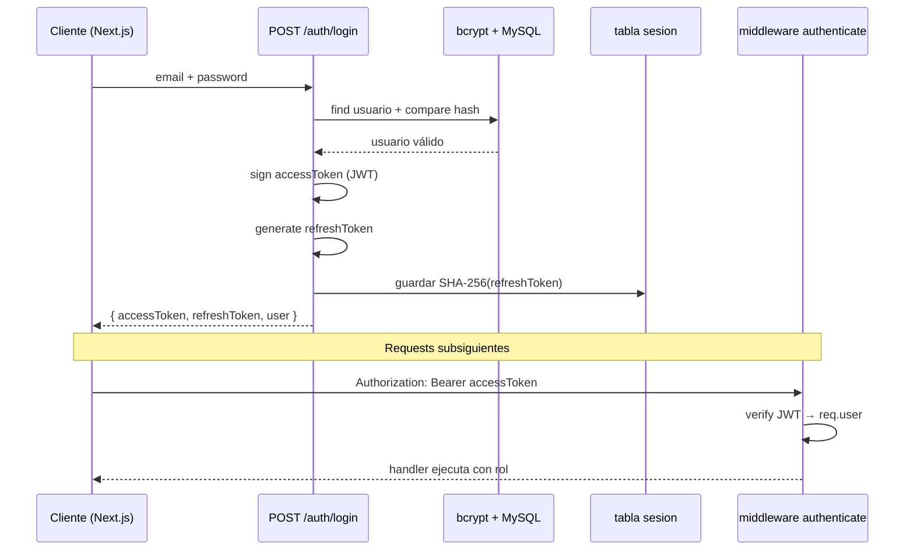
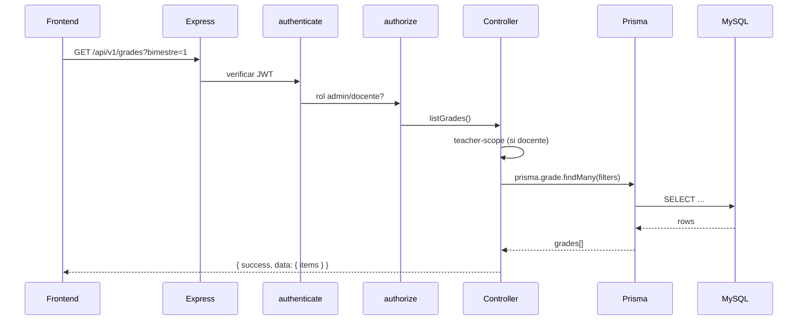

# Arquitectura del Backend — Detalle técnico

**Stack:** Node.js 20 · Express 4 · TypeScript · Prisma 6 · MySQL 8 · Railway

---

## 1. Arquitectura por capas

```
┌─────────────────────────────────────────────────────────────┐
│  CAPA DE PRESENTACIÓN (HTTP)                                 │
│  routes/index.ts · middleware/auth · errorHandler            │
├─────────────────────────────────────────────────────────────┤
│  CAPA DE CONTROLADORES                                       │
│  auth · students · teachers · grades · predict · alerts…     │
├─────────────────────────────────────────────────────────────┤
│  CAPA DE SERVICIOS                                           │
│  teacher-assignment · ml-client · profesor-dashboard         │
├─────────────────────────────────────────────────────────────┤
│  CAPA DE VALIDACIÓN                                          │
│  validators/ (Zod schemas)                                   │
├─────────────────────────────────────────────────────────────┤
│  CAPA DE ACCESO A DATOS                                      │
│  Prisma Client · utils/prisma.ts                             │
├─────────────────────────────────────────────────────────────┤
│  CAPA DE PERSISTENCIA                                        │
│  MySQL 8 (XAMPP local / Railway producción)                  │
└─────────────────────────────────────────────────────────────┘
         │ HTTP                              │ HTTP
         ▼                                   ▼
   Frontend Vercel                    ML Service :5000
```

| Capa | Responsabilidad | Ejemplo |
|------|-----------------|---------|
| Rutas | Enrutamiento HTTP, middleware chain | `router.get("/students", authenticate, …)` |
| Controladores | Parse request, invoke service, response | `grades.controller.ts` |
| Servicios | Lógica de negocio reutilizable | `teacher-assignment.service.ts` |
| Validadores | Contratos de entrada | `createStudentSchema` |
| Utils | Scope, audit, IDs BigInt | `teacher-scope.ts`, `audit.ts` |
| Prisma | Queries tipadas | `prisma.student.findMany()` |

---

## 2. Flujo de autenticación JWT



### Pasos detallados

1. **Login:** `POST /auth/login` → valida Zod → busca `usuario` por email → `bcrypt.compare`.
2. **Tokens:** Access JWT (payload: sub, role, exp) + refresh token opaco.
3. **Sesión:** Refresh hasheado SHA-256 en `sesion.token_hash` (max 128 chars).
4. **Requests:** Header `Authorization: Bearer <accessToken>`.
5. **Middleware `authenticate`:** Verifica firma, adjunta `req.user`.
6. **Middleware `authorize(...roles)`:** Compara rol JWT vs roles permitidos.
7. **Refresh:** `POST /auth/refresh` con refresh token → nuevo access token.

---

## 3. Flujo de una petición HTTP



**Cadena middleware típica:**

```
Request → helmet → cors → rateLimit → morgan → json()
       → authenticate → authorize("admin","docente") → controller → errorHandler
```

---

## 4. Diagrama de rutas (resumen)

```
/api/v1
├── /health                          [público]
├── /auth
│   ├── POST /login
│   ├── POST /refresh
│   ├── GET  /me                     [auth]
│   └── POST /change-password        [auth]
├── /academic/*                      [auth]
├── /students/*                      [auth, admin|docente]
├── /teachers/*                      [auth, admin CRUD]
├── /teacher-assignments/*           [auth, admin]
├── /profesor/*                      [auth, docente]
├── /estudiante/*                    [auth, estudiante]
├── /courses · /matriculas           [auth]
├── /grades · /attendance            [auth, admin|docente]
├── /predict · /predictions          [auth]
├── /dashboard/kpis                  [auth, admin|docente]
├── /alerts                          [auth, admin|docente]
├── /messages · /notifications       [auth]
├── /ml/metrics                      [auth, admin|docente]
├── /reports · /dashboard-snapshot   [auth]
├── /student-risks                   [auth]
└── /admin/*                         [auth, admin]
```

Diagrama completo en código: `backend/src/routes/index.ts`

---

## 5. Integración con Prisma

| Aspecto | Detalle |
|---------|---------|
| Schema | `backend/prisma/schema.prisma` — 51 tablas Blenkir v3 |
| Cliente | `import { prisma } from "../utils/prisma.js"` |
| Migraciones | `prisma/migrations/` — SQL versionado |
| Seed | `seed.ts` (estructura) + `seed-demo.ts` (660 alumnos) |
| IDs | BigInt convertidos con `toDbId`, `idToString` |
| Transacciones | `prisma.$transaction([...])` en operaciones compuestas |

**Comandos:**

```bash
npm run db:generate      # prisma generate
npm run db:migrate:deploy # producción
npm run db:seed:demo     # datos demo
npm run db:studio        # GUI
```

---

## 6. Integración con MySQL

| Entorno | Conexión | Plugin |
|---------|----------|--------|
| Local | `mysql://root@localhost:3306/tesis_dashboard` | XAMPP |
| Railway | `DATABASE_URL` inyectada | MySQL Railway plugin |

**Tablas críticas:**

- `usuario`, `sesion` — auth
- `student`, `teacher`, `matricula`, `seccion` — académico
- `grade`, `periodo_academico` — evaluación
- `prediction`, `alert` — IA
- `audit_log` — trazabilidad Director

**Validación demo:** `node backend/scripts/validate-demo-data.mjs`

---

## 7. Integración con Railway

```mermaid
flowchart LR
  GH[GitHub push] --> RW[Railway build]
  RW --> MS[npm run start:prod]
  MS --> MD[prisma migrate deploy]
  MD --> API[node dist/index.js]
  MY[(MySQL plugin)] --> API
  API --> HC[/health check]
```

| Elemento | Configuración |
|----------|---------------|
| Start | `npm run start:prod` → `railway-start.mjs` |
| Health | `GET /health` — timeout 120 s |
| Variables | `DATABASE_URL`, `JWT_SECRET`, `CORS_ORIGIN`, `NODE_ENV` |
| Ops flags | `RUN_DEMO_SEED=1`, `RUN_REPAIR=1` (temporal) |
| Recovery | P3009 auto-fix en `railway-start.mjs` |

**URL producción:** https://taller1-production.up.railway.app/api/v1

---

## 8. Integración con ML Service

```
predict.controller.ts
    → extrae 10 features del estudiante (Prisma)
    → ml-client.ts POST ML_SERVICE_URL/predict
    → persiste prediction + evalúa alert
    → retorna formato tesis (español)
```

Variable: `ML_SERVICE_URL=http://localhost:5000` (local)

---

## 9. Referencias

- [Arquitectura backend (visión)](../arquitectura/arquitectura-backend.md)
- [Arquitectura general](../arquitectura/arquitectura-general.md)
- [Modelo IA](../python-ia/modelo-predictivo.md)
- [DEPLOY](../DEPLOY.md)
