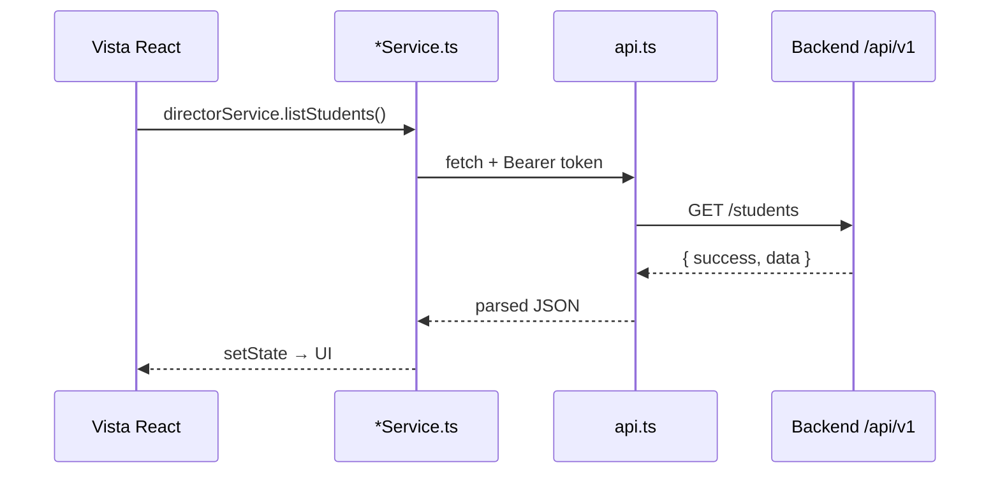

# Arquitectura del Frontend

**Sistema:** Tesis Dashboard v2.0  
**Stack:** Next.js 16 · React 19 · TypeScript · Tailwind CSS 4  
**Despliegue producción:** [Vercel](https://vercel.com)

---

## 1. Visión general

El frontend es una **aplicación web SPA** con App Router que presenta dashboards diferenciados por rol (Director, Profesor, Estudiante). Consume la API REST del backend y renderiza gestión académica, predicción de deserción, alertas y mensajería.

```
Usuario (navegador)
        │
        ▼
Next.js 16 (Vercel)
  App Router: /login, /
        │
        ▼
AuthProvider + useAuthReady
        │
        ▼
Vistas por rol → api.ts / *Service.ts
        │
        ▼
Backend Railway /api/v1
```

**URLs:**

| Entorno | URL |
|---------|-----|
| Producción | https://taller1-frontend.vercel.app |
| Local | http://localhost:3029 |

---

## 2. Tecnologías usadas

| Tecnología | Versión | Uso |
|------------|---------|-----|
| **Next.js** | 16.2 | Framework React, App Router, Turbopack |
| **React** | 19.x | Componentes UI |
| **TypeScript** | 5.x | Tipado estático |
| **Tailwind CSS** | 4.x | Estilos utility-first, modo claro/oscuro |
| **Recharts** | 2.x | Gráficos en dashboards |
| **Zod** | 3.x | Validación de formularios |
| **Sonner** | 1.x | Notificaciones toast |
| **Lucide React** | — | Iconografía |
| **jsPDF + xlsx** | — | Exportación de reportes |
| **Framer Motion** | 11.x | Animaciones UI |
| **@tesis/shared** | workspace | Tipos compartidos |

---

## 3. Estructura del código

```
frontend/
├── src/
│   ├── app/
│   │   ├── (auth)/login/page.tsx    # Pantalla de login
│   │   └── (shell)/page.tsx         # Shell principal + routing por sección
│   ├── components/
│   │   ├── layout/                  # AppShell, header
│   │   ├── dashboard/               # Dashboards por rol
│   │   ├── views/                   # Vistas Director/Profesor
│   │   ├── student/                 # Vistas Estudiante
│   │   └── ui/                      # Componentes reutilizables
│   ├── contexts/
│   │   └── AuthProvider.tsx         # Sesión JWT
│   ├── hooks/
│   │   ├── useAuthReady.ts          # Espera rol confirmado
│   │   ├── useAcademicData.ts       # Datos académicos
│   │   └── useProfessorStructure.ts # Filtros profesor
│   ├── services/
│   │   ├── api.ts                   # Cliente HTTP base
│   │   ├── directorService.ts       # Endpoints Director
│   │   ├── profesorService.ts       # Endpoints /profesor/*
│   │   └── estudianteService.ts     # Endpoints /estudiante/*
│   ├── data/
│   │   ├── navigation.ts            # Secciones de la app
│   │   └── sidebar-nav.ts           # Menú agrupado
│   └── lib/                         # Validaciones, utilidades
├── .env.local                       # NEXT_PUBLIC_API_URL
└── package.json
```

---

## 4. Componentes principales

### 4.1 Layout y navegación

| Componente | Responsabilidad |
|------------|-----------------|
| `AppShell` | Layout con sidebar, header, área de contenido |
| `AppSidebar` | Menú lateral agrupado por categorías |
| `EmptyState` | Estado vacío cuando no hay datos |

### 4.2 Autenticación

| Componente / Hook | Responsabilidad |
|-------------------|-----------------|
| `AuthProvider` | Token, usuario, rol desde localStorage + `/auth/me` |
| `useAuthReady` | `ready = !loading && user && role` — evita 401 prematuros |
| `login/page.tsx` | Formulario login, redirección al shell |

### 4.3 UI compartida

| Componente | Uso |
|------------|-----|
| `DataTablePanel` | Tablas con filtros |
| `RiskBadge` / `RiskGauge` | Visualización de riesgo IA |
| `CardSkeleton` | Loading states |
| `RiskBadge` | Etiquetas bajo/medio/alto |

---

## 5. Vistas por rol

### 5.1 Director (`admin`)

| Sección | Componente | Descripción |
|---------|------------|-------------|
| Dashboard | `RoleDashboard` | KPIs globales, gráficos |
| Estudiantes | `StudentsView` | CRUD estudiantes |
| Profesores | `TeachersView` | CRUD docentes |
| Asignaciones | `TeacherAssignmentsView` | Tutores y polidocencia |
| Cursos | `CoursesView` | Oferta académica |
| Matrículas | `EnrollmentsView` | Matrícula por año/sección |
| Notas | `GradesView` | Calificaciones por bimestre |
| Asistencia | `AttendanceView` | Registro asistencia |
| Actividad LMS | `LMSView` | Métricas plataforma virtual |
| Predicción | `PredictionView` | Ejecutar predicciones |
| Historial | `PredictionHistoryView` | Historial predicciones |
| Alertas | `AlertsView` | Gestión alertas tempranas |
| Mensajería | `MensajeriaAcademicaView` | Comunicados |
| Reportes | `ReportsView` | Exportación informes |

### 5.2 Profesor (`docente`)

| Sección | Componente |
|---------|------------|
| Dashboard | `ProfessorDashboard` |
| Estudiantes | `ProfessorStudentsView` |
| Notas | `ProfessorGradesView` |
| Asistencia | `ProfessorAttendanceView` |
| LMS | `ProfessorLMSView` |
| Predicción | `ProfessorPredictionView` |
| Alertas | `ProfessorAlertsView` |

### 5.3 Estudiante (`estudiante`)

| Sección | Componente |
|---------|------------|
| Dashboard | `StudentDashboard` |
| Mis notas | `StudentGradesView` |
| Mi asistencia | `StudentAttendanceView` |
| Mi actividad LMS | `StudentLMSView` |
| Mi riesgo | `StudentPredictionView` |
| Mensajería | `StudentMensajeriaView` |

---

## 6. Dashboard

### 6.1 Director — `RoleDashboard`

- Total estudiantes activos.
- Estudiantes en riesgo (medio/alto).
- Alertas pendientes.
- Gráficos Recharts: distribución de riesgo, tendencias.
- Datos desde `GET /dashboard/kpis` y agregados locales.

### 6.2 Profesor — `ProfessorDashboard`

- KPIs acotados a secciones donde dicta cursos.
- Lista de estudiantes en riesgo en su ámbito.
- Accesos rápidos a notas, asistencia y predicción.
- Datos desde `GET /profesor/dashboard`.

### 6.3 Estudiante — `StudentDashboard`

- Promedio y asistencia personal.
- Gauge de riesgo de deserción.
- Alertas recibidas.
- Datos desde `GET /estudiante/dashboard`.

### 6.4 Regla de carga (crítica)

Las vistas **no llaman APIs** hasta que `useAuthReady()` confirma el rol. Esto evita errores 401 al entrar sin recargar la página (fix v2.0.1).

---

## 7. Servicios HTTP

### 7.1 Cliente base — `api.ts`

- Base URL desde `NEXT_PUBLIC_API_URL`.
- Interceptor Bearer token desde localStorage.
- Manejo de errores y envelope `{ success, message, data }`.

### 7.2 Servicios por rol

| Servicio | Prefijo API | Consumidor |
|----------|-------------|------------|
| `directorService` | `/students`, `/teachers`, `/grades`… | Vistas Director |
| `profesorService` | `/profesor/*` | Vistas Profesor |
| `estudianteService` | `/estudiante/*` | Vistas Estudiante |

---

## 8. Navegación y menú

Definido en `sidebar-nav.ts` y filtrado por `ROLE_SECTIONS` en `(shell)/page.tsx`:

| Grupo sidebar | Secciones |
|---------------|-----------|
| Panel | Dashboard |
| Gestión académica | Estudiantes, Profesores, Asignaciones, Cursos, Matrículas, Notas, Asistencia, LMS |
| Predicción de deserción | Predicción, Historial, Alertas |
| Comunicación | Mensajería, Reportes |

El estudiante ve un subconjunto reducido (solo datos personales).

---

## 9. Vercel (despliegue)

### 9.1 Configuración

| Elemento | Valor |
|----------|-------|
| Framework | Next.js |
| Root directory | `frontend/` (monorepo) |
| Build | `@tesis/shared` + `next build` |
| Output | Static + server routes |

### 9.2 Variable de entorno

```env
NEXT_PUBLIC_API_URL=https://taller1-production.up.railway.app/api/v1
```

Configurar en **Production** y **Preview** en el dashboard de Vercel.

### 9.3 Flujo de deploy

1. Push a `main` en GitHub (`4dr1-2529/taller1`).
2. Vercel detecta cambios en monorepo.
3. Build: compila shared → frontend.
4. Despliega en `taller1-frontend.vercel.app`.

### 9.4 Verificación post-deploy

- Login con credenciales demo.
- Dashboard carga sin 401 en consola del navegador.
- CORS backend incluye URL Vercel.

---

## 10. Scripts de desarrollo

```bash
npm run dev:web              # Desde raíz monorepo
npm run lint                 # ESLint
npm run type-check           # TypeScript
npm run build --workspace=frontend
```

Puerto local: **3029**

---

## 12. Flujo de navegación

```mermaid
flowchart TD
  A[/login] --> B{AuthProvider}
  B -->|token válido| C[/(shell)]
  B -->|sin token| A
  C --> D{user.role}
  D -->|admin| E[ROLE_SECTIONS admin<br/>14 secciones]
  D -->|docente| F[ROLE_SECTIONS docente<br/>10 secciones]
  D -->|estudiante| G[ROLE_SECTIONS estudiante<br/>6 secciones]
  E --> H[AppSidebar filtrado]
  F --> H
  G --> H
  H --> I[Clic sección → switch en page.tsx]
  I --> J[Vista correspondiente]
```

**Pasos:**

1. Usuario accede a `/login` → ingresa credenciales.
2. `AuthProvider` guarda token y llama `GET /auth/me`.
3. Redirección a `/` (shell) → `useAuthReady` confirma rol.
4. `ROLE_SECTIONS[role]` filtra secciones del sidebar.
5. Clic en menú cambia estado `section` → renderiza componente en `(shell)/page.tsx`.

---

## 13. Integración con API

El frontend **no accede a MySQL ni al servicio ML directamente**. Toda comunicación pasa por el backend Railway.



| Capa | Archivo | Función |
|------|---------|---------|
| Vista | `StudentsView.tsx` | UI, formularios, tablas |
| Servicio rol | `directorService.ts` | Endpoints Director |
| Cliente HTTP | `api.ts` | Base URL, headers, errores |
| Backend | Express | Auth, RBAC, Prisma |

**Variable crítica:** `NEXT_PUBLIC_API_URL` en Vercel apunta a Railway.

---

## 14. Integración con IA (vía backend)

El frontend **no llama FastAPI :5000**. La predicción se solicita al backend, que orquesta ML + persistencia.

| Vista | Acción usuario | Endpoint frontend | Backend → ML |
|-------|----------------|---------------------|--------------|
| `PredictionView` | Predecir estudiante | `POST /predict` | ml-client → `:5000/predict` |
| `ProfessorPredictionView` | Predecir en ámbito | `POST /profesor/predicciones` | Idem + scope |
| `StudentPredictionView` | Ver mi riesgo | `GET /estudiante/prediccion` | Lee última prediction BD |
| `RoleDashboard` | KPIs riesgo | `GET /dashboard/kpis` | Agregados SQL |
| `AlertsView` | Alertas IA | `GET /alerts` | Tabla `alert` |

**Visualización IA en UI:** `RiskBadge`, `RiskGauge`, factores de riesgo en español, recomendación pedagógica.

---

## 15. Referencias

- [Arquitectura frontend (visión)](../arquitectura/arquitectura-frontend.md)
- [Arquitectura general](../arquitectura/arquitectura-general.md)
- [Backend — Arquitectura](../backend/backend-arquitectura.md)
- [Python IA — Modelo predictivo](../python-ia/modelo-predictivo.md)
- [Frontend README](../../frontend/README.md)
- [Despliegue](../DEPLOY.md)
- [Plan de pruebas ISO 29119](../../plan-pruebas/README.md)
