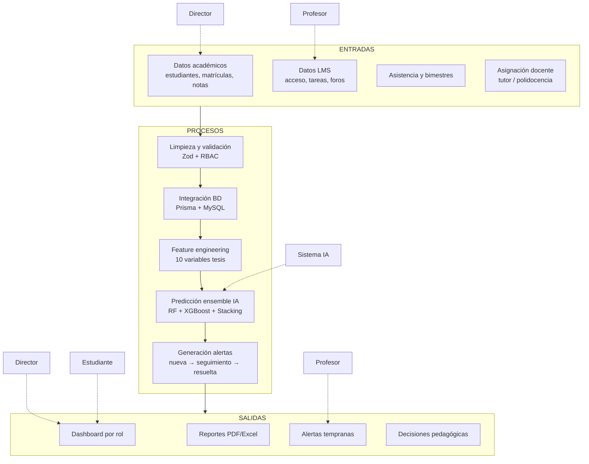

# Macroproceso de gestión académica — ISO 9001

**Sistema:** Tesis Dashboard v2.0  
**Institución:** I.E.P. Blenkir Huancayo · Perú  
**Norma de referencia:** ISO 9001:2015 — Sistemas de gestión de la calidad  
**Versión:** 2.0

---

## 1. Propósito

Documentar el **macroproceso de gestión académica** del I.E.P. Blenkir implementado en el sistema web inteligente de predicción de deserción, demostrando trazabilidad entre requisitos ISO 9001 y funcionalidades reales del software.

---

## 2. Diagrama del proceso

### 2.1 Diagrama Mermaid (macroproceso completo)



### 2.2 Diagrama ASCII (vista simplificada)

```
┌─────────────────────────────────────────────────────────────────────────┐
│                           ENTRADAS                                       │
│  Académicos │ LMS │ Asistencia │ Matrículas │ Asignación docente        │
└───────────────────────────────┬─────────────────────────────────────────┘
                                ▼
┌─────────────────────────────────────────────────────────────────────────┐
│                           PROCESOS                                       │
│  Validar → Persistir → Extraer features → Predecir IA → Crear alertas   │
└───────────────────────────────┬─────────────────────────────────────────┘
                                ▼
┌─────────────────────────────────────────────────────────────────────────┐
│                           SALIDAS                                        │
│  Dashboard │ Reportes │ Alertas │ Historial predicciones │ Mensajería   │
└─────────────────────────────────────────────────────────────────────────┘
         ▲                    ▲                         ▲
    Director            Profesor                  Estudiante
```

---

## 3. Entradas

| ID | Entrada | Origen | Formato | Responsable registro |
|----|---------|--------|---------|---------------------|
| EN-01 | Ficha estudiante (nombre, DNI, sección) | Gestión institucional | Formulario web / API | Director |
| EN-02 | Matrícula año lectivo + sección | Secretaría / Director | `POST /matriculas` | Director |
| EN-03 | Notas por curso y bimestre (0–20) | Evaluación docente | `POST /grades`, `/profesor/notas` | Profesor |
| EN-04 | Asistencia diaria / porcentual | Aula | `POST /attendance` | Profesor |
| EN-05 | Actividad LMS (accesos, tareas, foros) | Plataforma virtual | Tablas `lms_*` / seed | Sistema + Profesor |
| EN-06 | Asignación tutor 1°–2° | Dirección | `POST /teacher-assignments/tutor` | Director |
| EN-07 | Polidocencia 3°–6° | Dirección | `POST /teacher-assignments` | Director |
| EN-08 | Credenciales de acceso | Admin usuarios | `usuario.email` + bcrypt | Director |

**Requisitos ISO 9001 sobre entradas (7.5 — Información documentada):**

- Datos identificables y trazables por `studentId` y año lectivo.
- Validación de rangos antes de persistir (notas, asistencia).
- Bimestres I–II completos para predicción temprana.

---

## 4. Procesos

| ID | Proceso | Descripción | Componente sistema |
|----|---------|-------------|-------------------|
| PR-01 | **Recepción y validación** | Verificar integridad y rangos de datos entrantes | Express + Zod validators |
| PR-02 | **Limpieza / normalización** | Coerción numérica, sanitización XSS, rechazo IDs ajenos | `grades.controller`, `student-scope` |
| PR-03 | **Almacenamiento** | Persistencia relacional transaccional | Prisma ORM → MySQL 8 |
| PR-04 | **Control de acceso** | Filtrar datos por rol (Director / Profesor / Estudiante) | `authorize()`, `teacher-scope` |
| PR-05 | **Extracción de features** | Consolidar 10 variables para ML | `predict.controller` + queries Prisma |
| PR-06 | **Predicción IA** | Clasificar riesgo bajo/medio/alto | FastAPI `/predict` — ensemble |
| PR-07 | **Generación de alertas** | Crear alerta si riesgo ≥ umbral | Servicio predict → tabla `alert` |
| PR-08 | **Visualización** | Presentar KPIs y detalle por rol | Next.js dashboards |
| PR-09 | **Reportes** | Exportar información para decisión | `ReportsView`, jsPDF, xlsx |
| PR-10 | **Auditoría** | Registrar acciones críticas del Director | `audit_log` |

---

## 5. Salidas

| ID | Salida | Destinatario | Canal / endpoint |
|----|--------|--------------|------------------|
| SA-01 | Dashboard institucional (KPIs) | Director | `RoleDashboard`, `GET /dashboard/kpis` |
| SA-02 | Dashboard docente (ámbito propio) | Profesor | `ProfessorDashboard`, `/profesor/dashboard` |
| SA-03 | Dashboard personal + gauge riesgo | Estudiante | `StudentDashboard`, `/estudiante/dashboard` |
| SA-04 | Listado estudiantes en riesgo | Director / Profesor | Predicciones + alertas |
| SA-05 | Alertas tempranas | Director / Profesor / Estudiante | `/alerts`, `/profesor/alertas`, `/estudiante/alertas` |
| SA-06 | Reportes exportables | Director | `ReportsView`, `POST /reports` |
| SA-07 | Historial de predicciones | Director / Profesor | `/predictions`, `/profesor/historial-predicciones` |
| SA-08 | Recomendación pedagógica IA | Todos (según rol) | Campo `recomendacion` en respuesta predict |
| SA-09 | Comunicados académicos | Comunidad educativa | `/messages` |
| SA-10 | Trazabilidad de gestión | Director | `/admin/audit-logs` |

---

## 6. Clientes internos

| Cliente interno | Necesidad satisfecha | Salida que consume |
|-----------------|---------------------|-------------------|
| **Director** | Visión global, toma de decisiones institucionales | Dashboard KPIs, reportes, alertas globales, CRUD |
| **Profesor** | Seguimiento de su aula y registro académico | Notas, asistencia, LMS, predicción acotada, alertas propias |
| **Estudiante** | Autoconocimiento de desempeño y riesgo | Notas propias, asistencia, LMS, predicción personal |
| **Sistema IA** | Datos limpios y features consistentes | Entradas EN-03 a EN-05 vía backend |
| **Equipo de calidad (QA)** | Evidencias de cumplimiento ISO | `docs/evidencias/`, plan de pruebas 29119 |

---

## 7. Responsables

| Rol | Responsabilidad en el macroproceso | Herramienta |
|-----|-----------------------------------|-------------|
| **Director** | Gobierno del proceso, datos maestros, asignaciones, reportes | UI rol `admin` |
| **Profesor** | Captura operativa (notas, asistencia, LMS), seguimiento alertas | UI rol `docente` |
| **Estudiante** | Consulta de resultados personales (no gestiona el proceso) | UI rol `estudiante` |
| **Sistema IA** | Predicción objetiva, factores explicables, recomendación | `machine-learning/` |
| **Administrador técnico** | Despliegue, BD, migraciones, seed | Railway + Vercel |

---

## 8. Indicadores KPI

| KPI | Fórmula / definición | Meta | Fuente de medición |
|-----|---------------------|------|-------------------|
| **KPI-01** Estudiantes en riesgo | Count(`nivel_riesgo` ∈ {medio, alto}) | Identificar 100 % casos predichos | `/dashboard/kpis` |
| **KPI-02** Alertas generadas | Count(`alert.estado` = nueva + en_seguimiento) | 1 alerta por predicción medio/alto | `/alerts` |
| **KPI-03** Notas registradas | Notas bimestre I–II / (estudiantes × cursos) | ≥ 95 % cobertura | `validate-demo-data.mjs` |
| **KPI-04** Alertas resueltas | Resueltas / total alertas × 100 | Seguimiento documentado | PATCH `/alerts/:id` |
| **KPI-05** Disponibilidad API | Uptime `/health` | ≥ 99 % mensual | Railway monitoring |
| **KPI-06** F1 del modelo IA | F1-Score weighted en test set | ≥ 0.80 | `machine-learning/models/metrics.json` (F1=1.0, AUC=1.0) |
| **KPI-07** Tiempo respuesta predict | ms POST `/predict` | < 3000 ms | Smoke tests |
| **KPI-08** Cobertura docente | Salones con tutor/asignación | 22/22 secciones | `/teacher-assignments` |

---

## 9. Relación con ISO 9001

| Cláusula ISO 9001:2015 | Aplicación en el sistema |
|------------------------|--------------------------|
| **4.4 Sistema de gestión de la calidad** | Macroproceso documentado + indicadores KPI |
| **6.2 Objetivos de calidad** | KPI-01 a KPI-08 medibles en dashboard y métricas ML |
| **7.1.5 Recursos de seguimiento** | Tests automatizados, health checks, audit log |
| **7.5 Información documentada** | `docs/`, CHANGELOG, plan de pruebas, evidencias |
| **8.1 Planificación y control operacional** | Seed demo, repair, validación datos |
| **8.5 Producción y provisión del servicio** | Flujo entradas → procesos → salidas |
| **9.1 Seguimiento, medición, análisis** | KPIs, métricas ML, SonarQube |
| **10.2 No conformidad y acción correctiva** | Alertas + estados + recomendaciones IA |

---

## 10. Trazabilidad código — ISO 9001:2015

| Norma | Característica | Módulo | Archivo | Implementación | Evidencia | Estado |
|-------|----------------|--------|---------|----------------|-----------|--------|
| ISO 9001 | 4.4 — Procesos del SGC | Macroproceso académico | `docs/iso-9001/macroproceso-academico.md` | Entradas → procesos → salidas documentados | Diagrama Mermaid §2.1 | ✅ Verificado |
| ISO 9001 | 7.5 — Información documentada | Entrada estudiante | `frontend/src/components/views/StudentsView.tsx` | EN-01 ficha + `POST /students` | `evidencias-finales/estudiantes/estudiantes.png` | ✅ Verificado |
| ISO 9001 | 7.5 — Información documentada | Matrículas | `frontend/src/components/views/EnrollmentsView.tsx` | EN-02 `POST /matriculas` | `seed-demo.ts` (660 matrículas) | ✅ Verificado |
| ISO 9001 | 8.5 — Producción del servicio | Notas | `backend/src/controllers/grades.controller.ts` | EN-03 notas 0–20 bimestre | `evidencias-finales/notas/notas.png` | ✅ Verificado |
| ISO 9001 | 8.5 — Producción del servicio | Asistencia | `backend/src/controllers/attendance.controller.ts` | EN-04 registro asistencia | `AttendanceView` + API `/attendance` | ✅ Verificado |
| ISO 9001 | 8.5 — Producción del servicio | LMS | `frontend/src/components/views/LMSView.tsx` | EN-05 tablas `LmsActividad` | `prisma/schema.prisma` modelo LMS | ✅ Verificado |
| ISO 9001 | 8.1 — Control operacional | Asignación docente | `frontend/src/components/views/TeacherAssignmentsView.tsx` | EN-06/07 tutor + polidocencia | `evidencias-finales/configuracion/configuracion-asignaciones.png` | ✅ Verificado |
| ISO 9001 | 8.1 — Control operacional | Validación datos | `backend/src/validators/schemas.ts` | PR-01 Zod en todos los POST | `backend/tests/schemas.test.ts` | ✅ Verificado |
| ISO 9001 | 8.1 — Control operacional | Persistencia | `backend/prisma/schema.prisma` | PR-03 51 tablas MySQL | `db:push` + seed 660 estudiantes | ✅ Verificado |
| ISO 9001 | 8.1 — Control operacional | Control de acceso | `backend/src/middleware/auth.ts` | PR-04 `authorize(admin/docente/estudiante)` | `permissions.test.mjs` | ✅ Verificado |
| ISO 9001 | 8.1 — Control operacional | Feature engineering | `backend/src/controllers/predict.controller.ts` | PR-05 agrega métricas → ML | `ml-client.ts` `buildMlPayload()` | ✅ Verificado |
| ISO 9001 | 9.1 — Seguimiento y medición | Predicción IA | `machine-learning/train.py` | PR-06 RF+XGB+Stacking | `ia/metricas-ml.json`; F1=1.0 | ✅ Verificado |
| ISO 9001 | 10.2 — Acción correctiva | Alertas | `backend/src/controllers/predict.controller.ts` | PR-07 crea `Alerta` si riesgo medio/alto | `evidencias-finales/alertas/alertas.png` | ✅ Verificado |
| ISO 9001 | 9.1 — Seguimiento (KPI) | Dashboard | `backend/src/services/dashboard-analytics.service.ts` | PR-08 KPI-01 estudiantes en riesgo | `evidencias-finales/dashboard/dashboard.png` | ✅ Verificado |
| ISO 9001 | 9.1 — Seguimiento (KPI) | Reportes | `frontend/src/components/views/ReportsView.tsx` | PR-09 export decisión institucional | `evidencias-finales/reportes/reportes.png` | ✅ Verificado |
| ISO 9001 | 9.1 — Seguimiento (KPI) | Auditoría | `backend/src/controllers/admin.controller.ts` | PR-10 `GET /admin/audit-logs` | Rutas admin en `routes/index.ts` | ✅ Verificado |
| ISO 9001 | 6.2 — Objetivos de calidad | KPI cobertura notas | `backend/scripts/validate-demo-data.mjs` | KPI-03 19 680 calificaciones demo | Salida `db:seed:demo` | ✅ Verificado |
| ISO 9001 | 7.1.5 — Recursos de seguimiento | QA automatizado | `scripts/evidence/verify-stack.mjs` | Health frontend/backend/BD/IA | `verificacion-stack.json` (5/5 PASS) | ✅ Verificado |
| ISO 9001 | 7.1.5 — Recursos de seguimiento | UAT por rol | `plan-pruebas/pruebas-aceptacion/` | Director, profesor, estudiante | `director.md`, `profesor.md`, `estudiante.md` | ✅ Verificado |

---

## 11. Referencias

- [ISO 25010 — Calidad de software](../iso-25010/calidad-software.md)
- [ISO 29119 — Plan de pruebas](../../plan-pruebas/README.md)
- [Trazabilidad normas](../../plan-pruebas/matriz-pruebas/trazabilidad.md)
- [Evidencias QA](../../plan-pruebas/evidencias-finales/README.md)
