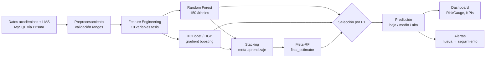

# Modelo predictivo de riesgo de deserción

**Sistema:** Tesis Dashboard v2.0 — Módulo IA  
**Stack:** Python 3.11+ · FastAPI · scikit-learn · XGBoost (opcional)  
**Ubicación código:** `machine-learning/`

---

## 1. Objetivo del modelo

Clasificar el **nivel de riesgo de deserción estudiantil** en tres categorías ordinales:

| Clase | Etiqueta | Significado pedagógico |
|-------|----------|------------------------|
| 0 | **Bajo** | Estudiante estable; seguimiento rutinario |
| 1 | **Medio** | Señales de alerta; requiere monitoreo |
| 2 | **Alto** | Riesgo elevado; intervención inmediata |

El modelo utiliza **ensemble learning** combinando múltiples algoritmos para maximizar robustez y generalización.

---

## 2. Arquitectura del módulo

```
machine-learning/
├── app/
│   ├── main.py          # FastAPI: /predict, /health, /metrics
│   └── features.py      # FEATURE_NAMES (10 variables)
├── models/
│   ├── best_model.joblib       # Modelo seleccionado por F1
│   ├── random_forest_model.joblib
│   ├── xgboost_model.joblib
│   ├── stacking_model.joblib
│   ├── features.joblib
│   └── metrics.json
├── train.py             # Entrenamiento y comparación
├── requirements.txt
└── tests/test_predict.py
```

**Integración:** El backend Express (`ml-client.ts`) envía features numéricas al servicio FastAPI y persiste el resultado en MySQL.

---

## 3. Flujo completo del modelo IA



### Pipeline detallado

| Etapa | Componente | Descripción |
|-------|------------|-------------|
| **1. Datos** | MySQL + Prisma | Notas, asistencia, LMS, matrícula del estudiante |
| **2. Preprocesamiento** | `predict.controller.ts` | Validación, coerción numérica, manejo nulos |
| **3. Feature Engineering** | `app/features.py` | Vector de 10 features normalizado |
| **4. Random Forest** | `RandomForestClassifier` | Modelo base robusto, class_weight balanced |
| **5. XGBoost** | `XGBClassifier` o HGB fallback | Boosting secuencial, alta precisión tabular |
| **6. Stacking** | `StackingClassifier` | Combina RF + HGB con CV=3 |
| **7. Metaaprendiz** | `final_estimator=RandomForest` | Aprende a ponderar predicciones base |
| **8. Predicción** | `best_model.joblib` | Clase 0/1/2 → bajo/medio/alto + probabilidad |
| **9. Dashboard** | Frontend Recharts/Gauge | Visualización KPIs y riesgo por rol |
| **10. Alertas** | `alerts.controller.ts` | Genera alerta si riesgo ≥ medio |

### Flujo ASCII

```
Datos (BD) → Backend extrae features → POST ML/predict
    → RF ──┐
    → XGB ─┼→ Stacking → Meta-RF → best_model
    → Persist prediction → Si riesgo alto/medio → Alert
    → Response JSON → Frontend Dashboard + AlertsView
```

---

## 4. Justificación de algoritmos

### 4.1 Random Forest — ¿Por qué?

| Criterio | Justificación |
|----------|---------------|
| Robustez | Tolerante a outliers en notas y asistencia escolar |
| No linealidad | Captura interacciones entre variables sin feature manual |
| Desbalance | `class_weight="balanced"` — pocos casos alto riesgo no se ignoran |
| Interpretabilidad | Importancia de features para explicar factores de riesgo |
| Rol en ensemble | Base estable para Stacking y meta-estimador final |

### 4.2 XGBoost — ¿Por qué?

| Criterio | Justificación |
|----------|---------------|
| Datos tabulares | Excelente en features numéricas estructuradas (tesis) |
| Regularización | `max_depth`, `learning_rate` evitan overfitting |
| Rendimiento | F1 competitivo vs RF en datos educativos sintéticos |
| Complementariedad | Corrige sesgo de RF mediante boosting secuencial |
| Fallback | HistGradientBoosting si XGBoost no disponible |

### 4.3 Stacking — ¿Por qué?

| Criterio | Justificación |
|----------|---------------|
| Ensemble learning | Tesis exige fusión de modelos, no uno solo |
| Metaaprendizaje | Meta-RF aprende cuándo confiar en RF vs boosting |
| Generalización | CV=3 reduce overfitting del meta-modelo |
| Selección objetiva | Mejor F1 entre RF, XGB y Stacking → `best_model.joblib` |
| Tesis | Demuestra técnica ensemble learning aplicada a deserción |

---

## 5. Variables de entrada (features)

10 variables alineadas con la tesis:

| # | Feature | Descripción |
|---|---------|-------------|
| 1 | `promedio` | Promedio general (0–20) |
| 2 | `cursos_desaprobados` | Cantidad de cursos desaprobados |
| 3 | `asistencia` | Porcentaje de asistencia (0–100) |
| 4 | `frecuencia_lms` | Frecuencia de acceso a LMS |
| 5 | `tiempo_plataforma` | Horas en plataforma virtual |
| 6 | `tareas_ratio` | Ratio tareas entregadas |
| 7 | `participacion` | Nivel de participación |
| 8 | `uso_foros` | Uso de foros (0–1) |
| 9 | `disminucion` | Disminución de rendimiento |
| 10 | `estado` | Estado académico codificado |

---

## 6. Random Forest

### 6.1 Descripción

**Random Forest** es un ensemble de árboles de decisión entrenados sobre submuestras bootstrap del dataset y subconjuntos aleatorios de features.

### 6.2 Configuración en el proyecto

```python
RandomForestClassifier(
    n_estimators=150,
    max_depth=12,
    min_samples_leaf=1,
    max_features="sqrt",
    random_state=42,
    class_weight="balanced",
)
```

### 6.3 Ventajas

- Robusto ante outliers y ruido.
- Maneja bien relaciones no lineales.
- `class_weight="balanced"` compensa desbalance de clases.
- Interpretable vía importancia de variables.

### 6.4 Rol en el ensemble

Actúa como **modelo base** y como **meta-estimador** final en Stacking.

---

## 7. XGBoost

### 7.1 Descripción

**XGBoost** (eXtreme Gradient Boosting) construye árboles de forma secuencial, corrigiendo errores de iteraciones previas mediante gradient boosting.

### 7.2 Configuración en el proyecto

```python
XGBClassifier(
    n_estimators=150,
    max_depth=6,
    learning_rate=0.1,
    random_state=42,
    eval_metric="mlogloss",
)
```

### 7.3 Fallback

Si XGBoost no está instalado o es incompatible, se usa **HistGradientBoostingClassifier** de scikit-learn con parámetros equivalentes.

### 7.4 Ventajas

- Alto rendimiento en datos tabulares.
- Regularización integrada (max_depth, learning_rate).
- Eficiente en datasets medianos.

---

## 8. Stacking (StackingClassifier)

### 8.1 Descripción

**Stacking** (stacked generalization) combina predicciones de modelos base mediante un **meta-clasificador** que aprende a ponderar sus salidas.

### 8.2 Configuración en el proyecto

```python
StackingClassifier(
    estimators=[
        ("rf", RandomForestClassifier(...)),
        ("hgb", HistGradientBoostingClassifier(...)),
    ],
    final_estimator=RandomForestClassifier(
        n_estimators=100, max_depth=6, random_state=42
    ),
    cv=3,
    passthrough=False,
)
```

### 8.3 Flujo

```
Features → [RF] ──┐
         → [HGB] ─┼→ Meta-RF → Clase (bajo/medio/alto)
```

### 8.4 Selección del mejor modelo

Tras entrenamiento, se compara **F1-Score** de RF, XGBoost/HGB y Stacking. El modelo con mayor F1 se guarda como `best_model.joblib`.

---

## 9. Métricas de evaluación

### 9.1 Accuracy (Exactitud)

**Fórmula:** `(TP + TN) / Total`

**Qué mide:** Proporción de predicciones correctas sobre el total.

**Interpretación en deserción:** % de estudiantes clasificados correctamente en su nivel de riesgo.

**Limitación:** Puede ser engañosa con clases desbalanceadas.

---

### 9.2 Precision (Precisión)

**Fórmula (weighted):** `TP / (TP + FP)` promediada por clase.

**Qué mide:** De los estudiantes marcados en riesgo alto/medio, cuántos realmente lo están.

**Importancia pedagógica:** Minimiza **falsas alarmas** — evita sobrecargar al equipo con alertas innecesarias.

---

### 9.3 Recall (Sensibilidad)

**Fórmula (weighted):** `TP / (TP + FN)` promediada por clase.

**Qué mide:** De los estudiantes realmente en riesgo, cuántos detecta el modelo.

**Importancia pedagógica:** Maximiza **detección temprana** — no dejar estudiantes en riesgo sin alertar.

---

### 9.4 F1-Score

**Fórmula:** `2 × (Precision × Recall) / (Precision + Recall)` (weighted)

**Qué mide:** Balance armónico entre precisión y sensibilidad.

**Uso en el proyecto:** **Criterio principal** para seleccionar `best_model.joblib`.

**Umbral orientativo:** F1 ≥ 0.80 en validación.

---

### 9.5 AUC (Area Under the ROC Curve)

**Qué mide:** Capacidad del modelo para **discriminar** entre clases a distintos umbrales de decisión. Valor entre 0.5 (azar) y 1.0 (perfecto).

**En clasificación multiclase (3 clases):**

- Se calcula por clase usando estrategia **One-vs-Rest (OvR)**.
- AUC macro = promedio de AUC por clase.

**Estado en el proyecto:** Las métricas actuales en `train.py` reportan Accuracy, Precision, Recall, F1 y matriz de confusión. AUC puede añadirse con `sklearn.metrics.roc_auc_score` (OvR) en evaluaciones futuras.

**Interpretación:**

| AUC | Calidad |
|-----|---------|
| 0.90 – 1.00 | Excelente |
| 0.80 – 0.89 | Buena |
| 0.70 – 0.79 | Aceptable |
| < 0.70 | Requiere mejora |

---

### 9.6 Matriz de confusión

**Qué mide:** Tabla cruzada entre **clase real** (filas) y **clase predicha** (columnas).

**Formato en `metrics.json`:**

```json
"confusion_matrix": [
  [TN_bajo,  FP_bajo→medio,  FP_bajo→alto ],
  [FN_medio,  TP_medio,      FP_medio→alto ],
  [FN_alto,   FN_alto→medio, TP_alto       ]
]
```

**Interpretación:**

- **Diagonal principal:** predicciones correctas por clase.
- **Fuera de diagonal:** errores de clasificación.
- En deserción, los **falsos negativos en clase alto** son los más críticos (estudiante en riesgo clasificado como bajo).

**Ejemplo visual:**

```
              Predicho
              Bajo  Medio  Alto
Real  Bajo  [ 180    12     3  ]
      Medio [  8     45     7  ]
      Alto  [  2      5    38  ]
```

---

## 10. Proceso de entrenamiento

```bash
npm run ml:train
# o
cd machine-learning && python train.py
```

### 10.1 Pasos

1. Generar dataset sintético (2500 muestras, `random_state=42`).
2. Split 80/20 estratificado train/test.
3. Entrenar RF, XGBoost/HGB y Stacking.
4. Evaluar con Accuracy, Precision, Recall, F1, matriz de confusión.
5. Seleccionar mejor modelo por F1.
6. Guardar artefactos joblib + `metrics.json` + `metrics_comparison.csv`.

### 10.2 Salida de métricas

| Archivo | Contenido |
|---------|-----------|
| `models/metrics.json` | Métricas por modelo + best_model |
| `models/metrics_comparison.csv` | Tabla comparativa |
| `models/training_history.json` | Timestamp y resultados |

---

## 11. Inferencia en producción

### 11.1 Endpoint FastAPI

```
POST http://localhost:5000/predict
```

**Respuesta (formato tesis):**

```json
{
  "score_predictivo": 72.5,
  "nivel_riesgo": "alto",
  "probabilidad_abandono": 0.78,
  "factores_riesgo": ["Baja asistencia", "Promedio en descenso"],
  "recomendacion": "Programar tutoría personalizada..."
}
```

### 11.2 Integración backend

```
Frontend → POST /api/v1/predict → Backend → ML Service → MySQL
```

### 11.3 Fallback

Si no existen modelos entrenados, el servicio aplica **heurística ponderada** con las mismas 10 variables.

---

## 12. Tests

```bash
npm run ml:test
```

Verifica:

- Formato de respuesta en español.
- Campos obligatorios: `nivel_riesgo`, `probabilidad_abandono`, `factores_riesgo`.
- Clasificación en {bajo, medio, alto}.

---

## 13. Referencias

- [Backend — Integración ML](../backend/backend-arquitectura.md)
- [ISO 25010 — Calidad](../iso-25010/calidad-software.md)
- [Plan de pruebas — Sección ML](../iso-29119/plan-pruebas.md#8-pruebas-del-modelo-ia)
- [Evidencias — Resultados ML](../evidencias/README.md)
- Código: `machine-learning/train.py`, `machine-learning/app/main.py`
