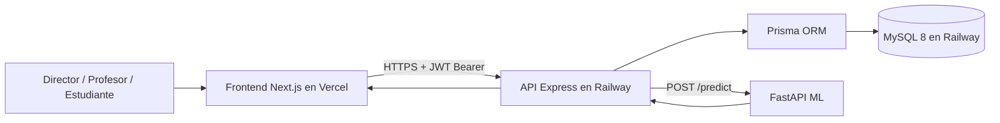
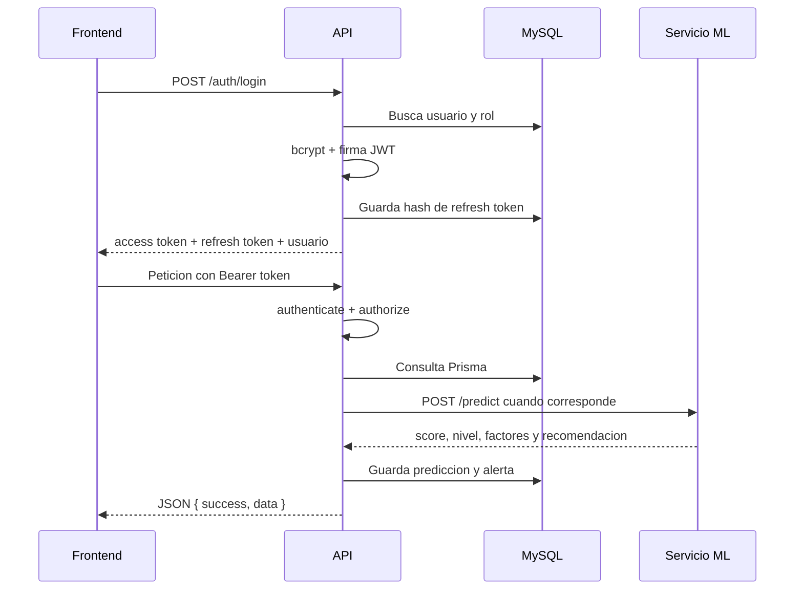
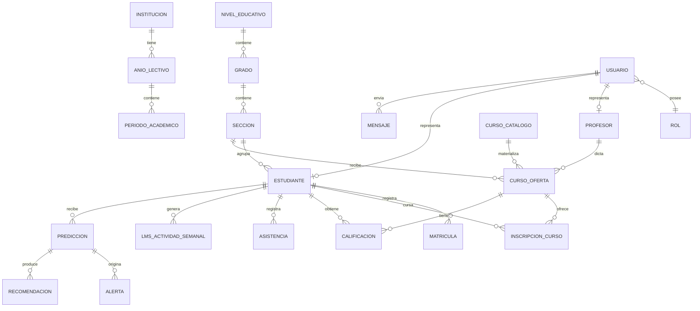

# Estructura completa del proyecto de tesis

**Proyecto:** Tesis Dashboard v2.0 - Sistema predictivo de riesgo de desercion estudiantil  
**Institucion objetivo:** I.E.P. Blenkir, Huancayo, Peru  
**Analisis realizado:** 2026-09-09  
**Fuente principal del modelo de datos:** `backend/prisma/schema.prisma`  
**Estado:** documento generado a partir del codigo, configuracion, esquemas y evidencias existentes en el repositorio.

---

## 1. Resumen ejecutivo

El proyecto es un monorepo JavaScript/TypeScript con tres subsistemas principales:

1. **Frontend web:** Next.js 16, React 19 y TypeScript. Se publica en Vercel.
2. **Backend API:** Node.js 20, Express 4, TypeScript y Prisma 6. Se publica en Railway.
3. **Servicio de inteligencia artificial:** Python, FastAPI y modelos de aprendizaje automatico. En desarrollo funciona en el puerto 5000; la documentacion indica que no esta desplegado en Railway por defecto.

La base de datos productiva es **MySQL 8**, administrada por el plugin MySQL de Railway. Prisma define el contrato actual con **52 modelos**, que se mapean a tablas con nombres en espanol. El sistema permite gestionar la estructura escolar, usuarios, docentes, estudiantes, cursos, matriculas, notas, asistencia, actividad LMS, predicciones de riesgo, alertas, mensajeria, reportes y auditoria.

El acceso esta dividido en tres roles funcionales:

- `admin`: se muestra como **Director**.
- `docente`: se muestra como **Profesor**.
- `estudiante`: se muestra como **Estudiante** o alumno.

El flujo central de la tesis es:



---

## 2. Estructura fisica del repositorio

La carpeta raiz es `tesis-dashboard/`.

```text
tesis-dashboard/
├── package.json                 # Workspace raiz y comandos globales
├── railway.toml                 # Build, start y healthcheck de Railway
├── docker-compose.yml           # Entorno local PostgreSQL historico/alternativo
├── frontend/                    # Aplicacion Next.js publicada en Vercel
├── backend/                     # API Express + Prisma publicada en Railway
├── machine-learning/            # Servicio FastAPI y entrenamiento Python
├── packages/shared/             # Paquete TypeScript compartido por workspace
├── database/                    # Esquemas SQL historicos y scripts SQL
├── docs/                        # Arquitectura, API, despliegue, roles y pruebas
├── plan-pruebas/                # Plan, matriz, evidencias y reporte QA
├── public/                      # Recursos publicos de la raiz
├── python-ia/                   # Documentacion adicional de la propuesta ML
├── estado-del-arte-software/    # Estado del arte organizado por tema
├── scripts/                     # Automatizaciones y generacion de evidencias
├── AGENTS.md / CLAUDE.md        # Instrucciones para agentes y colaboradores
└── estructura de proyecto/      # Este analisis
```

### 2.1 Workspace y comandos principales

El `package.json` raiz declara workspaces para `backend`, `frontend` y `packages/shared`. Los comandos mas importantes son:

| Comando | Funcion |
|---|---|
| `npm run dev` | Levanta web, API y ML con `concurrently`. |
| `npm run dev:web` | Frontend en el puerto 3029. |
| `npm run dev:api` | Backend en el puerto 4000. |
| `npm run dev:ml` | FastAPI en el puerto 5000. |
| `npm run build` | Compila shared, backend y frontend. |
| `npm run type-check` | Verifica tipos de shared, frontend y backend. |
| `npm run test` | Ejecuta pruebas unitarias, backend y ML. |
| `npm run db:migrate:deploy` | Aplica migraciones Prisma. |
| `npm run db:seed` | Carga estructura institucional. |
| `npm run db:seed:demo` | Carga datos de demostracion. |
| `npm run ml:train` | Entrena los modelos Python. |
| `npm run qa:pipeline` | Ejecuta el pipeline de pruebas documentado. |

---

## 3. Frontend: estructura y funcionamiento

### 3.1 Stack

- Next.js `16.2.4` con App Router.
- React `19.2.4`.
- TypeScript.
- Tailwind CSS 4 y PostCSS.
- Framer Motion para transiciones.
- Recharts para graficos.
- Lucide React para iconos.
- Sonner para notificaciones.
- XLSX y jsPDF para exportaciones.

Archivo de dependencias: [frontend/package.json](../frontend/package.json).

### 3.2 Carpetas principales

```text
frontend/src/
├── app/
│   ├── (auth)/login/page.tsx    # Pantalla de inicio de sesion
│   ├── (shell)/page.tsx         # Dashboard principal y seleccion de vistas
│   ├── layout.tsx               # Layout, fuentes, metadata y toaster
│   ├── globals.css              # Estilos globales y variables visuales
│   ├── error.tsx
│   └── not-found.tsx
├── components/
│   ├── dashboard/               # Dashboard Director, Profesor y compartido
│   ├── student/                 # Vistas exclusivas del estudiante
│   ├── professor/               # Filtros y componentes del profesor
│   ├── views/                   # Vistas academicas y administrativas
│   ├── layout/                  # AppShell y AppHeader
│   ├── academic/                # Filtros de grado, seccion y curso
│   ├── ui/                      # Skeletons, botones, badges y utilidades visuales
│   └── branding/                # Logo institucional
├── contexts/AuthProvider.tsx    # Sesion, tokens y rol actual
├── services/
│   ├── api.ts                   # Cliente HTTP y tipos de respuesta
│   ├── directorService.ts       # Operaciones de Director
│   ├── profesorService.ts       # Operaciones /profesor/*
│   └── estudianteService.ts     # Operaciones /estudiante/*
├── hooks/                       # Carga de datos y estructura academica
├── lib/                         # Mappers, filtros, agregados y utilidades
├── data/                        # Navegacion y etiquetas de secciones
├── constants/                   # Constantes de Blenkir y estudiante
└── types/                       # Tipos academicos y de UI
```

### 3.3 Flujo de autenticacion en el frontend

1. El usuario envia correo y contrasena desde `app/(auth)/login/page.tsx`.
2. `AuthProvider` llama `POST /api/v1/auth/login`.
3. El backend devuelve access token, refresh token y usuario con rol.
4. El frontend conserva los tokens y el usuario en `localStorage`:
   - `tesis-token`
   - `tesis-refresh-token`
   - `tesis-user`
5. Se consulta `GET /auth/me` para confirmar la sesion y el rol.
6. Si expira el access token, se llama `POST /auth/refresh`.
7. El menu se determina con `ROLE_SECTIONS` en `frontend/src/app/(shell)/page.tsx`.

La URL de la API se resuelve mediante `NEXT_PUBLIC_API_URL`. En desarrollo, si no existe, usa `http://localhost:4000/api/v1`; en produccion debe estar configurada para evitar que el frontend quede sin backend.

### 3.4 Pagina principal y menus

El shell general tiene:

- Sidebar con secciones permitidas por rol.
- Header con breadcrumb, fecha, notificaciones, tema y usuario.
- Area principal con vistas dinamicas.
- Banner cuando la fuente de datos no es la API.
- Dashboard de riesgo, alertas, KPIs, graficos y ranking.

**Director:** Dashboard, Estudiantes, Profesores, Asignaciones, Cursos, Matriculas, Notas, Asistencia, Actividad LMS, Prediccion, Historial de predicciones, Alertas, Mensajeria Academica y Reportes.

**Profesor:** Dashboard, Estudiantes de sus salones, Cursos, Notas, Asistencia, Actividad LMS, Prediccion, Historial de predicciones, Alertas y Mensajeria Academica.

**Estudiante:** Dashboard personal, Mis notas, Mi asistencia, Mi actividad LMS, Mi riesgo y Mensajeria Academica.

---

## 4. Backend: arquitectura y funcionamiento

### 4.1 Stack

- Node.js 20 o superior.
- Express 4.
- TypeScript.
- Prisma 6.
- MySQL 8.
- JWT y refresh tokens.
- bcryptjs para contrasenas.
- Zod para validacion.
- Helmet, CORS, Morgan y express-rate-limit para proteccion y operacion.

Archivo de entrada: [backend/src/index.ts](../backend/src/index.ts).  
Rutas: [backend/src/routes/index.ts](../backend/src/routes/index.ts).

### 4.2 Capas

```text
HTTP / Express
    ↓
routes/index.ts
    ↓
middlewares: CORS, rate limit, sanitize, authenticate, authorize
    ↓
controllers por dominio
    ↓
services y utils de negocio / scope
    ↓
Prisma Client
    ↓
MySQL
```

Carpetas del backend:

```text
backend/src/
├── config/         # Variables de entorno y aliases
├── controllers/    # Auth, estudiantes, profesores, notas, IA, reportes, etc.
├── middleware/     # JWT, sanitizacion y manejo de errores
├── routes/         # Rutas REST y permisos por endpoint
├── services/       # Scope docente, dashboard, estudiante y cliente ML
├── types/          # Tipos Express y tipos propios
├── utils/           # Prisma, auditoria, IDs BigInt, tokens y scopes
├── validators/      # Esquemas Zod
└── index.ts         # Arranque Express
```

### 4.3 Base de la API

La API publica sus rutas bajo `/api/v1`.

| Grupo | Funcion |
|---|---|
| `/health` | Salud del servicio. Es publico. |
| `/auth/*` | Login, refresh, usuario actual y cambio de contrasena. |
| `/academic/*` | Niveles, secciones, cursos catalogo y anos lectivos. |
| `/students/*` | Gestion de estudiantes, especialmente Director. |
| `/teachers/*` | Gestion de profesores y cuentas. |
| `/teacher-assignments/*` | Asignaciones de docentes y tutores. |
| `/profesor/*` | Dashboard y operaciones restringidas al profesor. |
| `/estudiante/*` | Dashboard y datos propios del estudiante. |
| `/courses` | Oferta de cursos. |
| `/matriculas` | Matricula institucional. |
| `/grades` | Notas. |
| `/attendance` | Asistencia individual y masiva. |
| `/predict` y `/predictions` | Generacion e historial de predicciones. |
| `/dashboard/kpis` | KPIs y analitica del dashboard. |
| `/alerts` | Alertas tempranas. |
| `/messages` y `/notifications` | Mensajeria y notificaciones. |
| `/ml/metrics` | Metricas del servicio ML. |
| `/reports` | Reportes y exportaciones. |
| `/student-risks` | Riesgos de estudiantes. |
| `/admin/*` | Usuarios, auditoria y estadisticas del sistema. |

### 4.4 Seguridad

- `authenticate()` exige `Authorization: Bearer <token>` y valida la firma JWT.
- `authorize("admin", "docente")` limita los endpoints al rol indicado.
- Las contrasenas se almacenan con bcrypt.
- El refresh token se firma, pero se guarda en la BD como hash SHA-256.
- El login tiene bloqueo temporal despues de varios intentos fallidos por IP.
- CORS acepta el frontend configurado y subdominios Vercel cuando esta permitido.
- Helmet agrega cabeceras de seguridad.
- express-rate-limit limita solicitudes en `/api/v1`.
- Zod valida entradas y `sanitizeBody` limpia el cuerpo de las solicitudes.
- Los IDs BigInt se serializan como texto para JSON.
- Se registra auditoria para acciones sensibles.

Flujo resumido:



---

## 5. Base de datos

### 5.1 Fuente vigente y motor

La fuente de verdad actual es [backend/prisma/schema.prisma](../backend/prisma/schema.prisma):

- Provider Prisma: `mysql`.
- Motor previsto: MySQL 8.
- IDs: `BigInt` autoincrementales.
- Nombres de tablas: espanol mediante `@@map`.
- Hay 52 modelos Prisma y, por tanto, 52 tablas de dominio definidas por el schema.
- Las migraciones se encuentran en `backend/prisma/migrations/`.
- Las semillas principales son `seed.ts`, `seed-demo.ts` y scripts de asignaciones.

### 5.2 Inventario de tablas/modelos

#### Modulo 1: institucion y calendario

| Modelo / tabla | Funcion y relaciones principales |
|---|---|
| `Institucion` / `institucion` | Datos de la institucion. Tiene anos lectivos. |
| `AnioLectivo` / `anio_lectivo` | Ano escolar; enlaza periodos, cursos, matriculas, asignaciones y snapshots. |
| `PeriodoAcademico` / `periodo_academico` | Bimestres o periodos; enlaza notas, historial, asistencia, LMS y predicciones. |

#### Modulo 2: estructura academica

| Modelo / tabla | Funcion y relaciones principales |
|---|---|
| `NivelEducativo` / `nivel_educativo` | Primaria o secundaria; contiene grados. |
| `Grado` / `grado` | Numero y nombre de grado; pertenece a un nivel y contiene secciones. |
| `Seccion` / `seccion` | Salon o seccion; pertenece a un grado y contiene estudiantes y oferta. |
| `AreaCurricular` / `area_curricular` | Area academica de un curso. |
| `CursoCatalogo` / `curso_catalogo` | Catalogo de cursos; pertenece a un area. |
| `CursoGrado` / `curso_grado` | Tabla puente que define cursos disponibles u obligatorios por grado. |

#### Modulo 3: seguridad y cuentas

| Modelo / tabla | Funcion y relaciones principales |
|---|---|
| `Role` / `rol` | Define `admin`, `docente` y `estudiante`. |
| `Permission` / `permiso` | Catalogo de permisos por modulo. |
| `RolePermission` / `rol_permiso` | Relacion muchos a muchos entre roles y permisos. |
| `User` / `usuario` | Cuenta de acceso, identidad, rol, estado y datos personales. |
| `Session` / `sesion` | Sesiones y hashes de refresh tokens. |
| `IntentoLogin` / `intento_login` | Registro de intentos de autenticacion. |

#### Modulo 4: personas

| Modelo / tabla | Funcion y relaciones principales |
|---|---|
| `Teacher` / `profesor` | Perfil del profesor y vinculacion opcional con `User`. |
| `Student` / `estudiante` | Perfil academico del estudiante, seccion, estado, promedio y asistencia global. |
| `Apoderado` / `apoderado` | Persona responsable del estudiante. |
| `StudentApoderado` / `estudiante_apoderado` | Relacion muchos a muchos estudiante-apoderado y parentesco. |

#### Modulo 5: oferta, tutoria y matricula

| Modelo / tabla | Funcion y relaciones principales |
|---|---|
| `TutorSeccion` / `tutor_seccion` | Asigna profesor tutor a una seccion y ano lectivo. |
| `TeacherCourseAssignment` / `asignacion_docente` | Asigna profesor a curso, grado, seccion y ano; identifica tutorias. |
| `Course` / `curso_oferta` | Oferta concreta de un curso para una seccion, profesor y ano. |
| `Matricula` / `matricula` | Matricula institucional de un estudiante en una seccion y ano. |
| `Enrollment` / `inscripcion_curso` | Inscripcion del estudiante en una oferta de curso. |
| `HorarioClase` / `horario_clase` | Dia, hora y aula de una oferta de curso. |

#### Modulo 6: informacion academica

| Modelo / tabla | Funcion y relaciones principales |
|---|---|
| `Grade` / `calificacion` | Nota de estudiante, curso ofertado y periodo. |
| `AcademicHistory` / `historial_academico` | Promedio, cursos desaprobados y asistencia por periodo. |

#### Modulo 7: asistencia

| Modelo / tabla | Funcion y relaciones principales |
|---|---|
| `Attendance` / `asistencia` | Registro diario de presente, tardanza y justificacion. |
| `ResumenAsistencia` / `resumen_asistencia` | Totales y porcentaje por estudiante y periodo. |

#### Modulo 8: actividad LMS

| Modelo / tabla | Funcion y relaciones principales |
|---|---|
| `LmsActivity` / `lms_actividad_semanal` | Actividad semanal, minutos, horas y conexiones. |
| `LmsEntregaTarea` / `lms_entrega_tarea` | Tareas totales, entregadas y ratio por curso y periodo. |
| `LmsIndicadorEstudiante` / `lms_indicador_estudiante` | Indicadores agregados usados por el modelo predictivo. |

#### Modulo 9: catalogo y trazabilidad de ML

| Modelo / tabla | Funcion y relaciones principales |
|---|---|
| `MlFeatureDef` / `ml_feature_def` | Define las variables de entrada, tipo, rango y orden. |
| `MlDataset` / `ml_dataset` | Dataset y version usados para entrenar. |
| `MlEntrenamiento` / `ml_entrenamiento` | Ejecucion de entrenamiento, algoritmos, estado y logs. |
| `MlModelo` / `ml_modelo` | Modelo entrenado, artifact, version y marca de produccion. |
| `MlMetrica` / `ml_metrica` | Accuracy, precision, recall, F1 y matriz de confusion. |

#### Modulo 10: predicciones y recomendaciones

| Modelo / tabla | Funcion y relaciones principales |
|---|---|
| `Prediction` / `prediccion` | Score, nivel, probabilidades, modelo, estudiante y periodo. |
| `PrediccionFeatureSnapshot` / `prediccion_feature_snapshot` | Congela las variables utilizadas en cada prediccion. |
| `PrediccionFactor` / `prediccion_factor` | Factores y contribuciones que explican el riesgo. |
| `AiRecommendation` / `recomendacion` | Recomendacion de intervencion y estado de aplicacion. |

#### Modulo 11: alertas

| Modelo / tabla | Funcion y relaciones principales |
|---|---|
| `Alert` / `alerta` | Alerta temprana vinculada a estudiante y prediccion. |
| `AlertaHistorial` / `alerta_historial` | Cambios de estado, usuario responsable y comentario. |
| `AlertaFactor` / `alerta_factor` | Factores que explican una alerta. |

#### Modulo 12: mensajeria

| Modelo / tabla | Funcion y relaciones principales |
|---|---|
| `MensajeSala` / `mensaje_sala` | Sala global, de profesores, curso o mensaje directo. |
| `ChatMessage` / `mensaje` | Mensaje, remitente, destinatario e hilo de respuestas. |
| `MessageRead` / `mensaje_lectura` | Estado de lectura por usuario. |

#### Modulo 13: sistema y trazabilidad

| Modelo / tabla | Funcion y relaciones principales |
|---|---|
| `AuditLog` / `auditoria` | Auditoria de acciones sobre entidades y usuarios. |
| `Report` / `reporte` | Reporte generado, tipo, autor, ruta y metadatos. |
| `Notification` / `notificacion` | Notificaciones de alertas, predicciones, sistema o reportes. |
| `DashboardSnapshot` / `dashboard_snapshot` | Fotografias historicas de KPIs por ano y periodo. |
| `SystemConfig` / `configuracion_sistema` | Parametros configurables del sistema. |

### 5.3 Relaciones nucleares de la BD



### 5.4 Reglas e integridad destacadas

- Un estudiante puede tener una matricula por ano lectivo mediante una restriccion unica.
- Una oferta de curso es unica por curso catalogo, seccion y ano lectivo.
- Una calificacion es unica por estudiante, oferta y periodo.
- La asistencia es unica por estudiante y fecha.
- Una prediccion conserva sus factores y snapshot de variables para trazabilidad.
- Las alertas conservan historial y factores explicativos.
- El borrado en cascada se utiliza en datos dependientes, mientras que roles, cursos y profesores tienen restricciones para proteger integridad historica.

### 5.5 Diferencia entre esquemas SQL y Prisma

El repositorio contiene `database/mysql`, `database/postgresql` y `database/blenkir-v3`, pero la aplicacion actual se conecta mediante Prisma al provider MySQL. El archivo `docker-compose.yml` levanta PostgreSQL y monta `database/postgresql/schema.sql`; esto sirve como entorno alternativo o historico, pero no coincide con la configuracion productiva documentada.

Para despliegue y desarrollo del backend debe priorizarse:

1. `backend/prisma/schema.prisma`.
2. `backend/prisma/migrations/`.
3. `backend/prisma/seed.ts` y `backend/prisma/seed-demo.ts`.
4. `DATABASE_URL` con formato MySQL.

---

## 6. Roles: Director, Profesor y Estudiante

### 6.1 Director (`admin`)

Representa a la direccion o administracion institucional.

Puede:

- Crear, consultar, actualizar y desactivar estudiantes.
- Crear, consultar, actualizar y desactivar profesores.
- Crear cuentas de profesores.
- Gestionar cursos, oferta academica y matriculas.
- Gestionar asignaciones docentes y tutores.
- Consultar y administrar notas y asistencia global.
- Ver KPIs institucionales, estudiantes y salones.
- Ejecutar y consultar predicciones de todos los estudiantes.
- Gestionar todas las alertas.
- Ver reportes globales y snapshots del dashboard.
- Gestionar usuarios administrativos, estadisticas y auditoria.
- Enviar comunicados globales y usar mensajeria institucional.

Su dashboard muestra indicadores como total de estudiantes, total de profesores, salones, alertas, promedio institucional, asistencia, distribucion de riesgo y analitica por grado/seccion.

### 6.2 Profesor (`docente`)

Representa al docente que trabaja con cursos o secciones asignadas.

Puede:

- Ver sus grados, secciones, cursos y estudiantes bajo su asignacion.
- Registrar y consultar notas de sus estudiantes.
- Registrar asistencia individual o masiva de sus estudiantes.
- Consultar actividad LMS de sus estudiantes.
- Ejecutar predicciones dentro de su alcance.
- Consultar y gestionar alertas de sus estudiantes.
- Ver historial de predicciones de su ambito.
- Usar mensajeria academica.
- Consultar el dashboard docente y filtrar por grado, seccion, curso y estudiante.

No puede:

- Crear o eliminar estudiantes.
- Crear o eliminar profesores.
- Acceder al dashboard institucional completo.
- Consultar estudiantes fuera de sus cursos o secciones.
- Administrar usuarios o configuracion global.

El alcance se aplica en backend con utilidades como `teacher-scope.ts` y servicios del profesor; no depende solo de ocultar elementos del frontend.

### 6.3 Estudiante / Alumno (`estudiante`)

Representa al alumno autenticado. Solo puede acceder a su propia informacion.

Puede consultar:

- Perfil personal y datos academicos.
- Dashboard personal.
- Notas por curso y bimestre.
- Historial de asistencia.
- Actividad LMS.
- Prediccion y nivel de riesgo propios.
- Alertas activas propias.
- Mensajeria academica recibida.

No puede:

- Consultar `/students` ni listados globales.
- Ver otros estudiantes.
- Ver filtros de grado, seccion o curso institucionales.
- Editar notas, asistencia, LMS o estados de alerta.
- Acceder a `/profesor/*`, `/dashboard/kpis` global ni reportes institucionales.
- Enviar un `studentId` arbitrario para consultar otro perfil.

La seguridad del estudiante se implementa con `requireStudentIdFromUser()` y `rejectClientStudentId()`, de forma que el identificador se obtiene del JWT y se rechaza un acceso a otro estudiante.

### 6.4 Matriz funcional resumida

| Funcion | Director | Profesor | Estudiante |
|---|---:|---:|---:|
| CRUD profesores | Si | No | No |
| CRUD estudiantes | Si | No | No |
| Cursos y matriculas | Gestion global | Consulta/alcance asignado | No |
| Notas | Global | Sus estudiantes | Solo lectura propia |
| Asistencia | Global | Sus estudiantes | Solo lectura propia |
| LMS | Global | Sus estudiantes | Solo propio |
| Predicciones | Global | Sus estudiantes | Solo propia |
| Alertas | Todas | Propias del alcance | Propias activas |
| Reportes globales | Si | Limitado | No |
| Mensajeria | Global/directa | Academica | Propia |
| Auditoria y usuarios | Si | No | No |

---

## 7. Machine Learning e inteligencia artificial

### 7.1 Servicio

El servicio esta en `machine-learning/` y usa FastAPI. Su entrada es `machine-learning/app/main.py`.

Endpoints:

| Metodo | Ruta | Funcion |
|---|---|---|
| `GET` | `/health` | Informa si el modelo esta cargado. |
| `POST` | `/predict` | Devuelve score, nivel, probabilidad, factores y recomendacion. |
| `GET` | `/metrics` | Devuelve metricas de los modelos entrenados. |

### 7.2 Variables de entrada

El backend construye un payload con diez variables:

1. `promedio_general`.
2. `cursos_desaprobados`.
3. `asistencia_general`.
4. `frecuencia_acceso_lms`.
5. `tiempo_plataforma`.
6. `tareas_ratio`.
7. `participacion_actividades`.
8. `uso_foros`.
9. `disminucion_actividad`.
10. `estado`.

### 7.3 Modelos y respaldo

La documentacion describe un conjunto de modelos:

- Random Forest.
- XGBoost o HistGradientBoosting cuando hay incompatibilidad.
- Stacking.
- Seleccion del mejor modelo por F1.

Los artefactos esperados son `best_model.joblib`, `features.joblib` y `metrics.json`. Si no hay artefacto cargado, el servicio usa una heuristica documentada para calcular el score.

### 7.4 Flujo de una prediccion

1. El backend obtiene datos academicos, asistencia y LMS del estudiante.
2. `backend/src/services/ml-client.ts` construye el payload.
3. El backend llama `POST ${ML_SERVICE_URL}/predict`.
4. El servicio ML valida rangos y genera resultado.
5. El backend persiste `Prediction`, factores, recomendacion y, cuando corresponde, `Alert`.
6. El frontend muestra nivel bajo, medio o alto, score, factores y recomendacion.

### 7.5 Interpretacion del riesgo

La heuristica documentada usa umbrales:

- Bajo: score menor que 41.
- Medio: score entre 41 y 64.
- Alto: score desde 65.

Estos resultados son apoyo para intervencion academica; no sustituyen la evaluacion del personal educativo.

---

## 8. Despliegue: Vercel, Railway y base de datos

### 8.1 Vercel: frontend

URL documentada: `https://taller1-frontend.vercel.app`

Configuracion:

- Framework: Next.js.
- Root Directory recomendado: `frontend`.
- Variable obligatoria:
  - `NEXT_PUBLIC_API_URL=https://taller1-production.up.railway.app/api/v1`
- `frontend/vercel.json` instala dependencias desde la raiz del monorepo y compila `@tesis/shared` y `frontend`.

El frontend no incluye la base de datos. Solo consume la API de Railway mediante HTTPS y JWT.

### 8.2 Railway: backend

URL documentada: `https://taller1-production.up.railway.app`

API base: `https://taller1-production.up.railway.app/api/v1`

Healthcheck: `https://taller1-production.up.railway.app/health`

Configuracion de `railway.toml`:

- Builder: Nixpacks.
- Build: instala dependencias, compila shared, genera Prisma y compila backend.
- Start: `npm run start:prod --workspace=backend`.
- Healthcheck: `/health`.
- Timeout de healthcheck: 120 segundos.
- Reinicio: `ON_FAILURE`.

El arranque `backend/scripts/railway-start.mjs`:

1. Normaliza aliases de variables.
2. Valida el entorno.
3. Ejecuta `prisma generate`.
4. Ejecuta `prisma migrate deploy`.
5. Intenta recuperar automaticamente un error P3009 de la migracion inicial.
6. Puede lanzar seed demo o reparacion mediante flags temporales.
7. Inicia `node dist/index.js`.

### 8.3 Railway: MySQL

El plugin MySQL de Railway entrega `DATABASE_URL` al servicio backend. La documentacion indica que la conexion interna utiliza `mysql.railway.internal:3306` mediante `${{MySQL.DATABASE_URL}}`.

Variables principales del backend:

| Variable | Uso |
|---|---|
| `DATABASE_URL` | Conexion MySQL de Railway. |
| `JWT_SECRET` | Firma JWT; minimo 32 caracteres. |
| `NODE_ENV` | Debe ser `production`. |
| `HOST` | `0.0.0.0` para escuchar externamente. |
| `CORS_ORIGIN` | URL del frontend Vercel. |
| `ML_SERVICE_URL` | URL del servicio ML. |
| `PORT` | Railway la inyecta automaticamente. |

### 8.4 Servicio ML en produccion

La documentacion actual indica que FastAPI no se despliega en Railway por defecto y que `ML_SERVICE_URL` queda apuntando a `http://localhost:5000`. Esto tiene una consecuencia importante:

- En desarrollo local, API y ML pueden comunicarse si ambos procesos estan levantados.
- En produccion, el servicio ML debe desplegarse separadamente y asignar una URL accesible desde Railway para que el backend use el modelo real.
- Mientras no exista esa URL, el backend puede devolver resultados de respaldo/heuristica segun la implementacion activa.

### 8.5 Datos demo

Las semillas documentadas generan una instalacion demo con:

- 660 estudiantes.
- 23 profesores.
- 22 secciones.
- Datos de notas de los bimestres I-II.
- Predicciones y alertas.
- Cuentas de Director, Profesor y Estudiante.

Comandos principales:

```bash
npm run db:seed --workspace=backend
npm run db:seed:demo --workspace=backend
```

Las cuentas de demostracion se documentan en `docs/cuentas-demo/` y requieren `DEMO_PASSWORD`.

---

## 9. Entorno local

### 9.1 Puertos

| Servicio | Puerto | URL local |
|---|---:|---|
| Frontend | 3029 | `http://localhost:3029` |
| Backend | 4000 | `http://localhost:4000/api/v1` |
| ML | 5000 | `http://localhost:5000` |
| MySQL XAMPP | 3306 | `mysql://...` |

### 9.2 Docker Compose

El `docker-compose.yml` actual levanta PostgreSQL 16 en el puerto 5432 y monta `database/postgresql/schema.sql`. No es el mismo motor configurado por `backend/prisma/schema.prisma`, que usa MySQL.

Por ello, hay dos caminos documentados en el repositorio:

- **Camino operativo recomendado:** MySQL 8 local con XAMPP o MySQL Railway y Prisma.
- **Camino alternativo/historico:** PostgreSQL con Docker y el SQL de `database/postgresql`.

No se deben mezclar `DATABASE_URL` de PostgreSQL con el Prisma provider MySQL sin cambiar y validar el schema completo.

---

## 10. Pruebas y evidencias

La carpeta `plan-pruebas/` contiene matriz, casos, capturas y logs.

Se documentan pruebas de:

- Login para los tres roles.
- JWT, refresh y permisos 401/403.
- Dashboard de Director, Profesor y Estudiante.
- CRUD academico.
- Notas y asistencia.
- Prediccion y alertas.
- Integracion con ML.
- Rendimiento.
- Build, lint y type-check.

El reporte final existente indica como evidencia de ejecucion local: 660 estudiantes, 23 profesores, API en 4000, web en 3029 y ML en 5000. Tambien informa incidencias en algunos pasos unitarios/caja blanca, aunque los pasos de build, type-check, API y capturas aparecen como aprobados en ese reporte. Para afirmar el estado actual, se debe volver a ejecutar el pipeline, ya que esas evidencias tienen fecha propia y pueden quedar desactualizadas.

Referencias:

- [plan-pruebas/README.md](../plan-pruebas/README.md)
- [plan-pruebas/REPORTE-FINAL-PRUEBAS.md](../plan-pruebas/REPORTE-FINAL-PRUEBAS.md)
- [docs/API.md](../docs/API.md)
- [docs/roles-permisos.md](../docs/roles-permisos.md)
- [docs/DEPLOY.md](../docs/DEPLOY.md)

---

## 11. Observaciones tecnicas importantes

1. **La BD vigente es MySQL + Prisma.** Los SQL PostgreSQL y algunos esquemas de `database/` son referencias alternativas o historicas.
2. **El ML no esta integrado como servicio productivo completo por defecto.** Para usar el modelo real en produccion hay que desplegar FastAPI o configurar un proveedor externo y actualizar `ML_SERVICE_URL`.
3. **El control de estudiante esta aplicado en backend.** No depende solamente del menu oculto del frontend.
4. **La asignacion docente es la base del alcance del profesor.** `TeacherCourseAssignment`, `TutorSeccion` y `Course` relacionan profesor, curso, grado, seccion y ano lectivo.
5. **El sistema tiene soporte de trazabilidad, pero el flujo de predicción está incompleto.** El schema contempla variables, modelo y periodo; el controlador actual persiste principalmente score, probabilidades y factores. Las alertas guardan factores e historial y las acciones sensibles se auditan.
6. **El frontend y el backend tienen URLs separadas.** Vercel sirve la interfaz; Railway sirve API y BD mediante servicios independientes.
7. **Las variables de entorno son parte critica del despliegue.** Un `JWT_SECRET` corto, un `CORS_ORIGIN` incorrecto, una `DATABASE_URL` ausente o un `NEXT_PUBLIC_API_URL` faltante impiden el funcionamiento completo.
8. **Los numeros de datos demo son datos de semilla.** 660 estudiantes, 23 profesores y 22 secciones describen el escenario de demostracion, no necesariamente datos reales de produccion.
9. **El reporte de pruebas debe actualizarse.** Las evidencias existentes son utiles para trazabilidad, pero no sustituyen una ejecucion nueva despues de cambios del codigo.

---

## 12. Archivos clave para continuar el mantenimiento

- [README.md](../README.md): vision general y comandos.
- [package.json](../package.json): workspaces y scripts.
- [backend/prisma/schema.prisma](../backend/prisma/schema.prisma): modelo vigente de BD.
- [backend/src/routes/index.ts](../backend/src/routes/index.ts): mapa de API y permisos.
- [backend/src/middleware/auth.ts](../backend/src/middleware/auth.ts): autenticacion y autorizacion.
- [backend/src/config/env.ts](../backend/src/config/env.ts): variables requeridas.
- [backend/src/services/ml-client.ts](../backend/src/services/ml-client.ts): integracion API-ML.
- [frontend/src/app/(shell)/page.tsx](../frontend/src/app/(shell)/page.tsx): menu y flujo principal por rol.
- [frontend/src/contexts/AuthProvider.tsx](../frontend/src/contexts/AuthProvider.tsx): sesion en frontend.
- [frontend/vercel.json](../frontend/vercel.json): build de Vercel.
- [railway.toml](../railway.toml): build y deploy de Railway.
- [docs/DEPLOY.md](../docs/DEPLOY.md): procedimiento de despliegue.
- [docs/roles-permisos.md](../docs/roles-permisos.md): matriz de permisos.
- [docs/machine-learning.md](../docs/machine-learning.md): variables y modelos de tesis.
- [machine-learning/app/main.py](../machine-learning/app/main.py): servicio predictivo.

---

## 13. Auditoria tecnica ampliada

Esta seccion distingue entre comportamiento comprobado en el codigo y aspectos que solo aparecen en documentacion o datos de evidencia.

### 13.1 Estado comprobado

La validacion ejecutada durante este analisis produjo:

| Validacion | Resultado |
|---|---|
| `npm run type-check` | Correcto en `@tesis/shared`, `frontend` y `backend`. |
| Pruebas unitarias de formato de prediccion | 4 correctas, 0 fallos. |
| Pruebas backend | 27 correctas en el primer bloque y 31 correctas en el segundo bloque. |
| Pruebas Python de ML | 6 correctas. |
| Diagnosticos del archivo de este informe | Sin errores detectados. |

Estas pruebas son principalmente unitarias y de contrato. No demuestran por si solas que Vercel, Railway, MySQL y el servicio ML remoto esten disponibles al mismo tiempo.

### 13.2 Hallazgos de severidad alta

#### A. Recuperacion P3009 con borrado total potencial

`backend/scripts/railway-start.mjs` ejecuta `recoverFailedInitMigration()` automaticamente cuando detecta P3009. Esa rutina usa `railway-drop-all-tables.sql`, que elimina todas las tablas del schema antes de volver a migrar.

Aunque los comentarios advierten que debe usarse solo con una BD vacia o de prueba, el flujo de arranque no exige una confirmacion interactiva ni una variable explicita de seguridad antes de ejecutarlo. En una BD productiva con datos, un error de migracion podria provocar perdida total.

**Recomendacion:** convertir la recuperacion destructiva en una operacion manual o exigir una variable como `ALLOW_DESTRUCTIVE_MIGRATION_RECOVERY=1`, con verificacion de entorno y respaldo previo.

#### B. ML productivo no esta garantizado

`predict.controller.ts` llama a `predictWithMl()` y, si falla, utiliza `computeLocalRisk()`. Esto mantiene disponible la funcionalidad, pero puede ocultar que la prediccion real de ML esta desconectada. La respuesta informa `source`, pero el dashboard puede seguir funcionando con el motor local.

La configuracion documentada deja `ML_SERVICE_URL=http://localhost:5000` en Railway, donde normalmente no existe un FastAPI dentro del mismo proceso. Por tanto, el resultado productivo puede ser heuristico aunque la interfaz muestre una prediccion valida.

**Recomendacion:** desplegar ML como servicio separado, configurar una URL privada o publica segura, añadir healthcheck dependiente de ML y mostrar claramente el origen del modelo en el dashboard.

#### C. Trazabilidad de prediccion incompleta en persistencia

El modelo de datos tiene `modeloId`, `periodoId` y `PrediccionFeatureSnapshot`, pero `backend/src/controllers/predict.controller.ts` al crear `Prediction` solo persiste estudiante, score, niveles, probabilidades y factores. En ese flujo no se observa el guardado de:

- modelo utilizado;
- periodo academico;
- snapshot completo de las diez variables de entrada.

La API devuelve `inputData`, pero devolverlo no equivale a conservarlo en la base de datos. Esto reduce la reproducibilidad de una prediccion historica y debilita la auditoria cientifica de la tesis.

**Recomendacion:** persistir modelo, periodo, variables, version del modelo y origen (`machine-learning` o `local-engine`) en una transaccion junto con la prediccion.

### 13.3 Hallazgos de severidad media

#### D. Documentacion inconsistente sobre el numero de tablas

El schema actual contiene 52 modelos, confirmado con el conteo de declaraciones `model` en `backend/prisma/schema.prisma`. Sin embargo, el propio schema, `seed.ts`, `README.md`, CHANGELOG, documentos de arquitectura y SQL legacy siguen diciendo 51 tablas.

Esto no rompe la ejecucion, pero puede producir errores en la memoria de tesis, diagramas ER, auditorias ISO y presentaciones. El informe actual usa 52 como cifra vigente y deja 51 como referencia historica.

#### E. Scripts legacy mezclan nombres de schema antiguos

`backend/prisma/migrate-roles.sql` utiliza tablas y columnas como `User.role`, `ChatMessage.senderRole` y roles `tutor`, `psicologo` y `apoderado`, que no corresponden al schema Prisma actual (`usuario.rol_id`, `mensaje`, tres roles activos).

Debe tratarse como migracion historica, no como procedimiento operativo. Ejecutarlo contra la BD actual podria fallar o modificar una estructura equivocada.

#### F. Dos motores de base de datos en el repositorio

Prisma y Railway usan MySQL, pero `docker-compose.yml` levanta PostgreSQL y monta `database/postgresql/schema.sql`. Tambien existe un esquema MySQL legacy en `database/blenkir-v3`.

La coexistencia es util para antecedentes de la tesis, pero aumenta el riesgo de que un colaborador levante PostgreSQL y crea estar probando la misma aplicacion. Debe existir una guia local unica o nombres explicitos como `docker-compose.postgresql-legacy.yml`.

#### G. Desactivacion de TLS en verificadores de produccion

`backend/scripts/export-production-accounts.mjs` y `verify-production-accounts.mjs` configuran `rejectUnauthorized: false` en solicitudes HTTPS. Eso permite conectarse aunque el certificado sea invalido y deja vulnerable la transferencia de credenciales y tokens.

**Recomendacion:** eliminar esa opcion y fallar ante certificados invalidos. Si se necesita probar un entorno local, usar una opcion separada y nunca el flujo de produccion.

#### H. Las cuentas exportadas incluyen contrasenas en archivos

Los scripts de cuentas generan `cuentas.json`, `profesores.csv` y `estudiantes.csv` con una columna `password`. Aunque esto facilita las pruebas demo, es un riesgo si esos archivos se publican, se suben al repositorio o quedan en artefactos de CI.

**Recomendacion:** excluirlos del control de versiones, generar archivos temporales con permisos restringidos y no exportar contrasenas reales desde produccion.

### 13.4 Deuda tecnica y rendimiento

#### I. Posible N+1 en dashboard de profesor

`profesor-dashboard.service.ts` recorre cursos y consulta estudiantes por seccion dentro del bucle. Con muchos cursos o profesores, la cantidad de consultas crece linealmente. Conviene precargar conteos y calificaciones o agrupar consultas con `groupBy`.

#### J. Calculo de dashboard pesado

`dashboard-analytics.service.ts` ejecuta varias consultas paralelas, despues carga filas de estudiantes, alertas y LMS para agregarlas en memoria. El limite de 120 predicciones recientes puede hacer que la tendencia no represente todo el historial.

#### K. Permisos declarativos y permisos efectivos conviven

La BD tiene `Permission` y `RolePermission`, pero las rutas se autorizan principalmente con `authorize("admin", "docente")`. En la practica, el contrato efectivo esta en el codigo de rutas y no en el catalogo de permisos de la BD. Si se cambia un permiso en la tabla sin modificar rutas, el comportamiento no cambia.

**Recomendacion:** elegir una fuente de verdad para autorizacion o documentar formalmente que `RolePermission` es catalogo/auditoria y que RBAC efectivo vive en middleware.

#### L. Importaciones sin uso en el router

`backend/src/routes/index.ts` importa `sendCreated`, `resolveStudentScope` y `logAudit`, pero no los utiliza en el archivo. No es un fallo funcional porque TypeScript compila, pero indica limpieza pendiente y puede ocultar rutas que antes tenian responsabilidades en este modulo.

### 13.5 Riesgos metodologicos de la tesis

- El dataset descrito como sintetico tiene 2500 registros; por tanto, metricas perfectas o cercanas a 1.0 no deben presentarse como validacion de datos reales sin explicar origen, separacion train/test y posible fuga de informacion.
- El seed genera datos academicos deterministas y predicciones de demostracion. Esos datos sirven para QA, pero no representan necesariamente una cohorte real.
- El score local, la heuristica FastAPI y el modelo entrenado pueden producir resultados diferentes para la misma entrada. La tesis debe identificar que motor se uso en cada experimento.
- La recomendacion generada por reglas es orientativa y no mide si la intervencion mejoro la permanencia del estudiante.
- Las evidencias de `plan-pruebas/` son fechadas; deben actualizarse despues de cambios importantes y antes de afirmar disponibilidad de produccion.

### 13.6 Que esta implementado y que esta documentado

| Area | Implementado en codigo | Solo documentado o condicionado |
|---|---|---|
| Frontend por rol | Si, en App Router y componentes | La URL de Vercel depende de configuracion externa. |
| API REST | Si, rutas y controladores | La disponibilidad publica depende de Railway. |
| MySQL + Prisma | Si, schema, migracion y seeds | El contenido real de Railway requiere consultar la BD. |
| RBAC | Si, middleware y scopes | La matriz de permisos de BD no gobierna todas las rutas. |
| ML FastAPI | Si, servicio y pruebas locales | Despliegue productivo no incluido por defecto. |
| Fallback local | Si, `risk-engine.ts` | Puede ocultar una desconexion del ML remoto. |
| Datos demo | Si, seeds reproducibles | No son datos reales de la institucion. |
| QA | Si, pruebas automatizadas | Capturas y evidencias no sustituyen pruebas actuales en nube. |
| PostgreSQL Docker | Si, como esquema alternativo | No es el provider actual de Prisma. |

### 13.7 Orden recomendado de mejoras

1. Proteger la recuperacion P3009 y quitar el borrado automatico del arranque.
2. Desplegar y monitorizar el servicio ML real, diferenciando claramente fallback y modelo.
3. Guardar snapshots de features, modelo, version, periodo y origen en cada prediccion.
4. Retirar o aislar scripts SQL legacy y actualizar referencias de 51 a 52 tablas.
5. Eliminar `rejectUnauthorized: false` y evitar contrasenas en exportaciones.
6. Optimizar consultas N+1 del dashboard docente y agregaciones de dashboard.
7. Ejecutar QA contra servicios desplegados y guardar evidencias con fecha y commit.

---

## Conclusion

La tesis esta implementada como una plataforma web institucional de tres capas: una interfaz Next.js, una API Express con reglas de negocio y un servicio ML separado, respaldados por MySQL y Prisma. El dominio esta modelado de forma amplia: no solo almacena usuarios y estudiantes, sino tambien calendario escolar, asignaciones docentes, matriculas, evaluaciones, asistencia, actividad LMS, explicaciones de riesgo, alertas, mensajeria, reportes y auditoria.

La separacion por roles es consistente entre menu frontend, endpoints backend y restricciones de alcance. El Director trabaja a nivel institucional, el Profesor trabaja sobre sus asignaciones y el Estudiante solo sobre su propio expediente. En despliegue, Vercel aloja el frontend, Railway aloja backend y MySQL, y los puntos que requieren atencion operativa son la disponibilidad real del servicio ML en produccion, la recuperacion segura de migraciones y la trazabilidad completa de cada prediccion.
