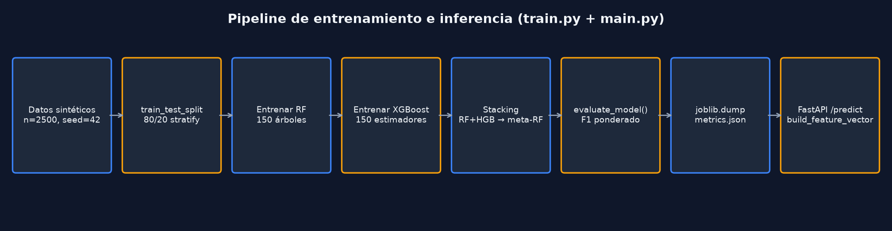

# Pipeline de Entrenamiento e Inferencia



## Pipeline de entrenamiento (`train.py`)

| Paso | Código | Salida |
|------|--------|--------|
| 1. Datos | `generate_synthetic_data(2500)` L38–80 | `X` (2500×10), `y` labels 0/1/2 |
| 2. Split | `train_test_split(test_size=0.2, stratify=y)` L97–98 | 2000 train / 500 test |
| 3. RF | `make_rf().fit(X_train, y_train)` L101–118 | `random_forest_model.joblib` |
| 4. XGB | `XGBClassifier(...).fit()` L124–143 | `xgboost_model.joblib` |
| 5. Stacking | `StackingClassifier(...).fit()` L146–159 | `stacking_model.joblib` |
| 6. Evaluación | `evaluate_model()` L83–91 | accuracy, precision, recall, F1, CM |
| 7. Selección | `max(results, key=f1_score)` L168 | `best_model.joblib` |
| 8. Persistencia | `json.dump(metrics.json)` L192–220 | CSV comparativo |

## Generación de etiquetas (sintético)

`generate_synthetic_data()` crea **tres bloques de perfil** (bajo/medio/alto riesgo) con rangos distintos por variable, los concatena, mezcla con `perm` y asigna etiquetas 0/1/2 por bloque.

Pesos del score en `compute_risk_score()` (calibrados respecto a la versión anterior):

```python
(14 - promedio) * 3.0 * 0.40      # antes 0.22
+ cursos_desaprobados * 9 * 0.22   # antes 0.12
+ (85 - asistencia) * 0.45 * 0.30
+ (1 - estado) * 28               # antes 14
# ... ver train.py
```

Ruido gaussiano `N(0, 0.015)` sobre `X`. Semilla `42`.

## Pipeline de inferencia (`app/main.py`)

```
PredictInput (Pydantic)
    → validate_predict_payload()     # utils/validators.py
    → _normalize_input()             # aliases LMS / participación
    → build_feature_vector()         # (1, 10) float64
    → model.predict() / predict_proba()
    → LEVEL_MAP[pred]                # bajo|medio|alto
    → proba_to_score(proba)          # score 0-100
    → build_factors()                # top-5 factores explicables
    → auto_recommendation()          # texto intervención
    → PredictOutput + campos tesis
```

## Evaluación offline (`evaluate.py`)

- Regenera 1200 muestras sintéticas.
- Split 75% test (500 no — 25% test = 300).
- Carga modelos guardados sin reentrenar.
- Escribe `reports/evaluation_report.json`.

## Integración backend

`ml-client.ts` → timeout 8s en predict, 5s en metrics. Si `res.ok` es false, backend usa `risk-engine` local.
