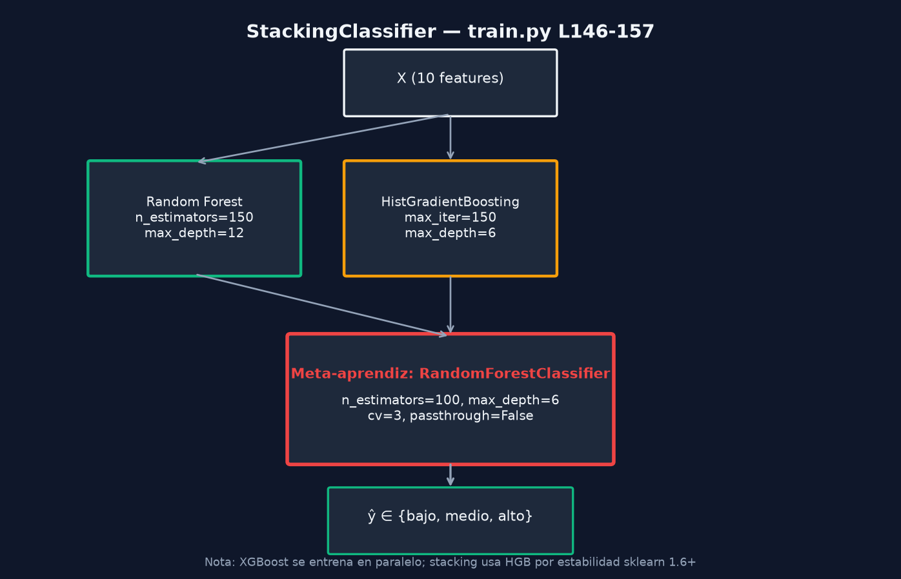

# Stacking — Ensemble Implementado



## Configuración (`train.py` L145–157)

```python
StackingClassifier(
    estimators=[
        ("rf", make_rf()),
        ("hgb", make_hgb()),
    ],
    final_estimator=RandomForestClassifier(
        n_estimators=100,
        max_depth=6,
        min_samples_leaf=1,
        max_features="sqrt",
        random_state=42,
    ),
    cv=3,
    passthrough=False,
)
```

## Estimadores base (nivel 0)

| ID | Clase | Hiperparámetros clave |
|----|-------|----------------------|
| `rf` | `RandomForestClassifier` | 150 árboles, depth 12, balanced |
| `hgb` | `HistGradientBoostingClassifier` | 150 iter, depth 6, lr 0.1 |

Comentario en código L145: *"Stacking: RF + HGB (estable con sklearn 1.6+)"*.

## Validación cruzada interna

- `cv=3` — 3 folds para generar meta-features de entrenamiento del meta-aprendiz.
- `passthrough=False` — el meta-aprendiz solo recibe predicciones de los estimadores base, no las features originales.

## Artefactos

| Archivo | Contenido |
|---------|-----------|
| `stacking_model.joblib` | Ensemble completo serializado |
| `best_model.joblib` | Puede ser RF, XGB o stacking según F1 |

Última ejecución: `best_model` = `random_forest` (no stacking), aunque stacking también alcanza F1=1.0.

## Métricas stacking (`metrics.json`)

```json
"stacking": {
  "accuracy": 1.0,
  "precision": 1.0,
  "recall": 1.0,
  "f1_score": 1.0,
  "confusion_matrix": [[500,0,0],[0,0,0],[0,0,0]]
}
```

## Inferencia

FastAPI carga `best_model.joblib` (prioridad) o `stacking_model.joblib` como fallback (`main.py` L93–96). El stacking completo expone la misma interfaz sklearn: `predict`, `predict_proba`.

## Relación con XGBoost

XGBoost se entrena **fuera** del stacking. Son cuatro modelos persistidos:

1. `random_forest_model.joblib`
2. `xgboost_model.joblib`
3. `stacking_model.joblib`
4. `best_model.joblib` (ganador por F1)
