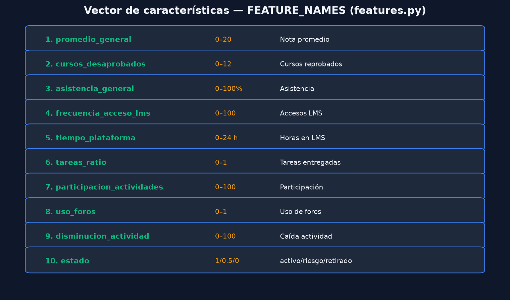
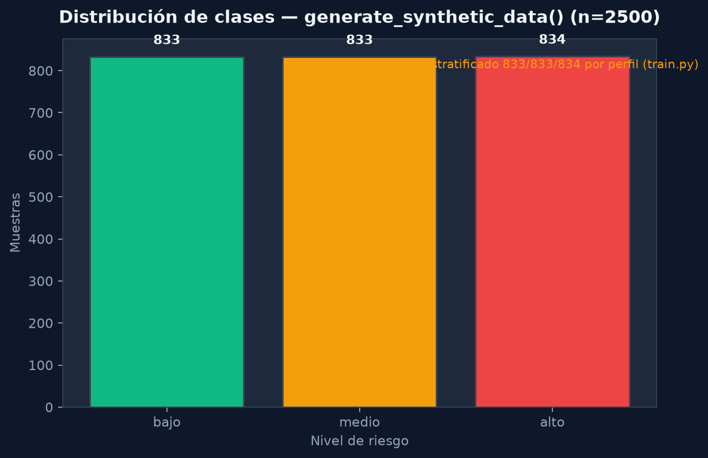

# Variables Utilizadas

## Lista completa (`FEATURE_NAMES`)

| # | Variable | Rango API | Perfil bajo | Perfil medio | Perfil alto |
|---|----------|-----------|-------------|--------------|-------------|
| 1 | `promedio_general` | 0–20 | 14–18 | 11–14 | 6–11 |
| 2 | `cursos_desaprobados` | 0–12 | Poisson(0.4) | Poisson(1.2) | Poisson(2.8) |
| 3 | `asistencia_general` | 0–100 | 88–100 | 72–88 | 50–75 |
| 4 | `frecuencia_acceso_lms` | 0–100 | 70–98 | 45–70 | 15–48 |
| 5 | `tiempo_plataforma` | 0–24 h | 0.5–12 | 0.5–12 | 0.5–12 |
| 6 | `tareas_ratio` | 0–1 | 0.80–1.0 | 0.55–0.82 | 0.15–0.55 |
| 7 | `participacion_actividades` | 0–100 | 20–95 | 20–95 | 20–95 |
| 8 | `uso_foros` | 0–1 | 0–1 | 0–1 | 0–1 |
| 9 | `disminucion_actividad` | 0–100 | 0–12 | 8–25 | 18–40 |
| 10 | `estado` | 1/0.5/0 | 92% activo | 55% activo | 50% retirado |

## Etiquetas objetivo

| Label | Nombre | Muestras (n=2500) |
|-------|--------|-------------------|
| 0 | `bajo` | 833 |
| 1 | `medio` | 833 |
| 2 | `alto` | 834 |

**Etiquetado:** estratificado por bloque de perfil (`train.py` → `generate_synthetic_data`). Cada tercio del dataset corresponde a un perfil académico antes del shuffle.

## Score de riesgo (referencia)

`compute_risk_score()` usa pesos calibrados; umbrales de referencia:

- `score < 41` → bajo  
- `41 ≤ score < 65` → medio  
- `score ≥ 65` → alto  

Funciones exportadas: `compute_risk_score`, `score_to_labels` en `train.py`.

## Distribución

