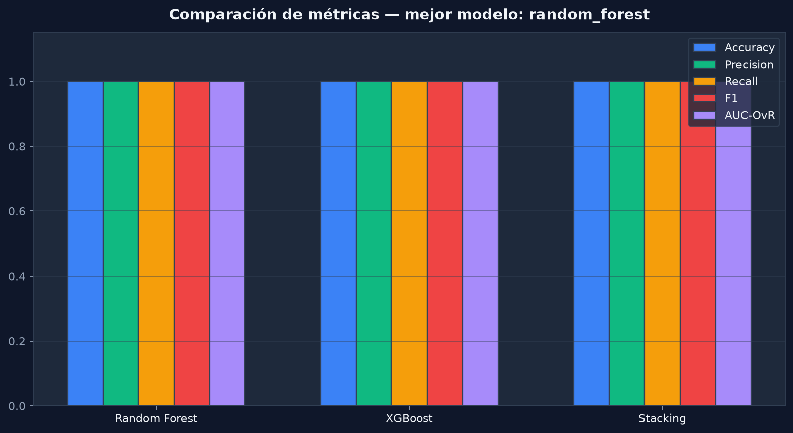
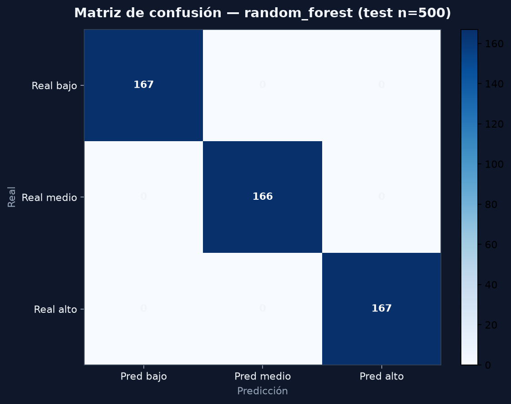
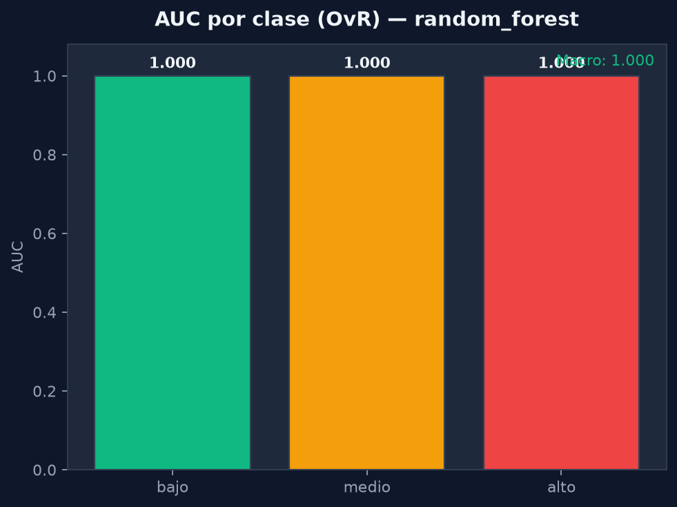
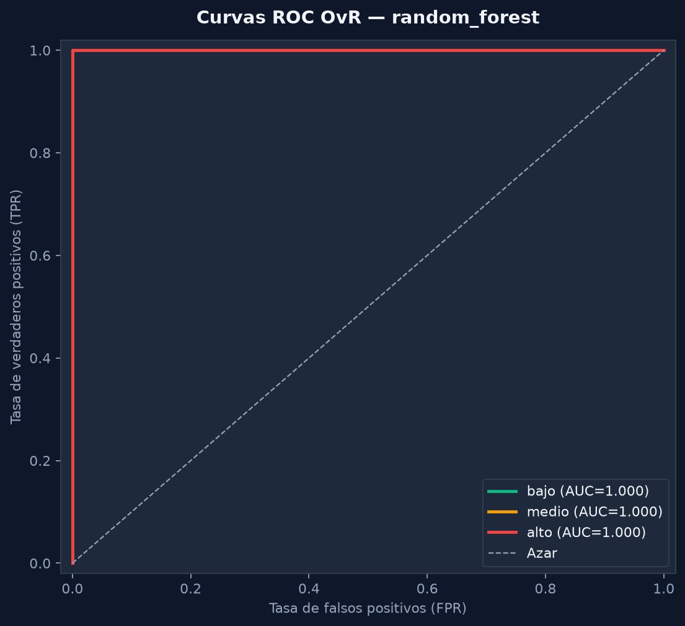
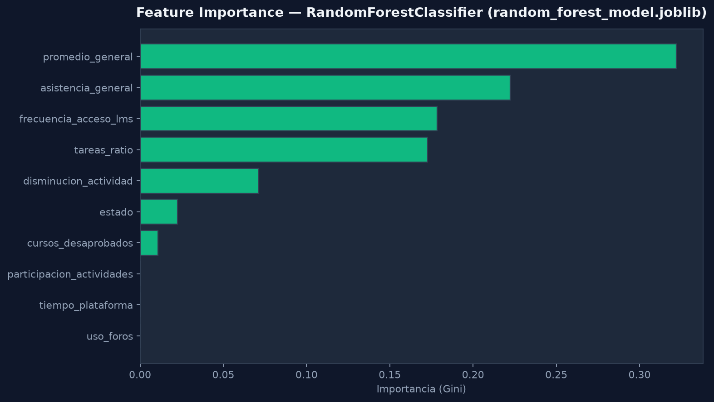

# Métricas del Modelo

Fuente: `machine-learning/models/metrics.json` (último `train.py`).

## Función de evaluación (`evaluate_model`)

```python
# train.py — métricas calculadas en test
accuracy, precision, recall, f1_score  # weighted, labels=[0,1,2]
confusion_matrix
roc_auc_ovr_weighted, roc_auc_ovr_macro
roc_auc_per_class  # OvR por bajo/medio/alto
roc_curves         # fpr/tpr por clase (para diagramas)
```

**Criterio de selección:** máximo `f1_score` ponderado → `best_model`.

## Distribución de clases (entrenamiento)

| Clase | Muestras |
|-------|----------|
| bajo | 833 |
| medio | 833 |
| alto | 834 |

Generación estratificada por perfil académico en `generate_synthetic_data()`.

## Comparación entre modelos



| Modelo | Accuracy | Precision | Recall | F1 | AUC-OvR |
|--------|----------|-----------|--------|-----|---------|
| random_forest | 1.0000 | 1.0000 | 1.0000 | 1.0000 | 1.0000 |
| xgboost | 1.0000 | 1.0000 | 1.0000 | 1.0000 | 1.0000 |
| stacking | 1.0000 | 1.0000 | 1.0000 | 1.0000 | 1.0000 |

`best_model`: **random_forest**

CSV: `models/metrics_comparison.csv` (incluye columna `roc_auc_ovr_weighted`).

## Matriz de confusión (random_forest, test n=500)



```
              Pred bajo  Pred medio  Pred alto
Real bajo        167          0          0
Real medio         0        166          0
Real alto          0          0        167
```

Clasificación perfecta en test con perfiles estratificados y separables.

## AUC (Area Under ROC Curve)

| Métrica | random_forest |
|---------|---------------|
| AUC OvR weighted | 1.0000 |
| AUC OvR macro | 1.0000 |
| AUC clase bajo | 1.0000 |
| AUC clase medio | 1.0000 |
| AUC clase alto | 1.0000 |



Implementado con `sklearn.metrics.roc_auc_score(multi_class="ovr")` en `train.py`.

## Curvas ROC



Curvas **One-vs-Rest** por clase, datos en `metrics.json` → `roc_curves`. Generadas para el `best_model` en `python-ia/scripts/generate_diagrams.py`.

## Feature Importance



Extraída de `random_forest_model.joblib` → `feature_importances_` (importancia Gini).

## Accuracy / Precision / Recall / F1

Todas **1.0000** en test para los tres modelos — coherente con matriz diagonal perfecta y perfiles sintéticos bien separados.

## Endpoints

```
GET http://localhost:5000/metrics
GET http://localhost:4000/ml/metrics  (admin/docente)
```

## Regenerar métricas y diagramas

```bash
cd machine-learning && python train.py
cd .. && python python-ia/scripts/generate_diagrams.py
```

Reporte: `datos/analysis_report.json`
