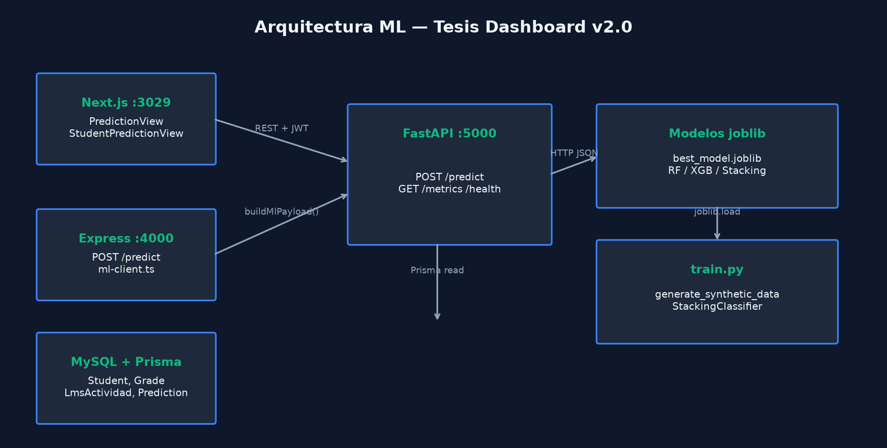

# Documentación Científica — Módulo IA

Análisis del módulo `machine-learning/` de **Tesis Dashboard v2.0**. Todo el contenido deriva del código fuente, artefactos `models/` y ejecución real de `train.py`.

## Índice

| Documento | Contenido |
|-----------|-----------|
| [01-arquitectura.md](./01-arquitectura.md) | Servicios, integración Express ↔ FastAPI |
| [02-pipeline.md](./02-pipeline.md) | Flujo entrenamiento e inferencia |
| [03-random-forest.md](./03-random-forest.md) | Hiperparámetros RF implementados |
| [04-xgboost.md](./04-xgboost.md) | XGBClassifier y fallback HGB |
| [05-stacking.md](./05-stacking.md) | StackingClassifier |
| [06-metaaprendiz.md](./06-metaaprendiz.md) | Meta-estimador del ensemble |
| [07-feature-engineering.md](./07-feature-engineering.md) | `build_feature_vector`, factores |
| [08-preprocesamiento.md](./08-preprocesamiento.md) | Validación, normalización, split |
| [09-variables.md](./09-variables.md) | 10 variables y rangos |
| [10-metricas.md](./10-metricas.md) | Accuracy, F1, matriz, ROC/AUC |

## Diagramas

Generados por `scripts/generate_diagrams.py` (11 diagramas, incl. ROC y AUC):



## Comandos

```bash
cd machine-learning
pip install -r requirements.txt
python train.py
python -m uvicorn app.main:app --port 5000

cd ..
python python-ia/scripts/generate_diagrams.py
```

## Artefactos del modelo

| Archivo | Origen |
|---------|--------|
| `machine-learning/models/best_model.joblib` | Mejor F1 en `train.py` |
| `machine-learning/models/random_forest_model.joblib` | RF evaluado |
| `machine-learning/models/xgboost_model.joblib` | XGBoost o HGB |
| `machine-learning/models/stacking_model.joblib` | Ensemble |
| `machine-learning/models/features.joblib` | Orden `FEATURE_NAMES` |
| `machine-learning/models/metrics.json` | Métricas de test |

## Artículos científicos

Papers y fichas Word: **[docs/ARTICULOS Y ESTADO DEL ARTE/](../docs/ARTICULOS%20Y%20ESTADO%20DEL%20ARTE/README.md)**

## Datos de análisis

- `datos/metrics_snapshot.json` — copia de métricas al generar diagramas
- `datos/analysis_report.json` — distribución de clases, importancias, estado ROC/AUC
